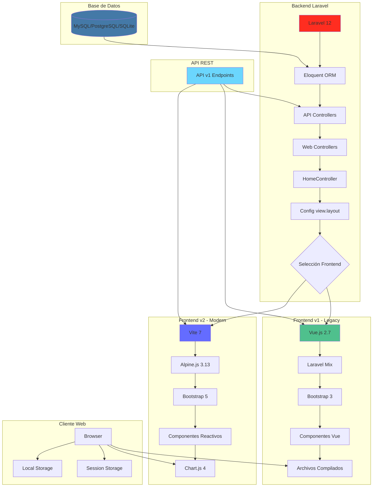
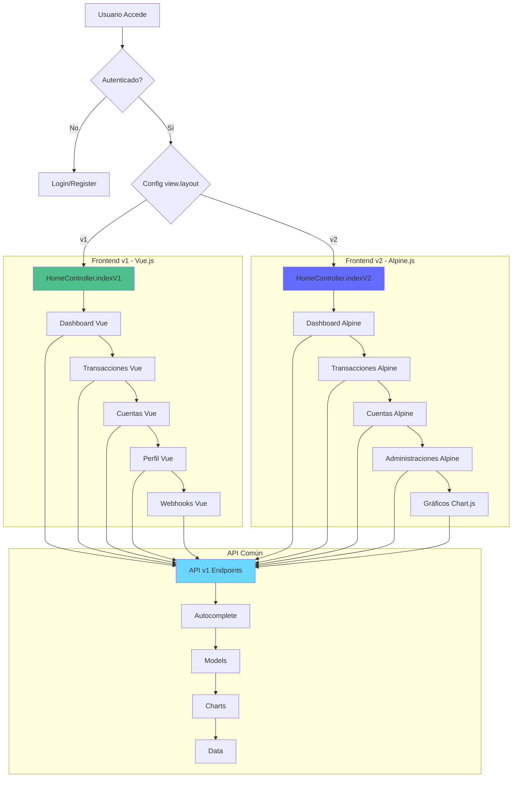
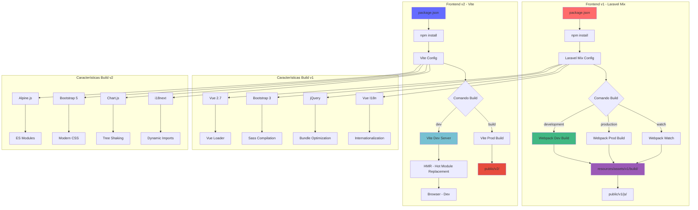
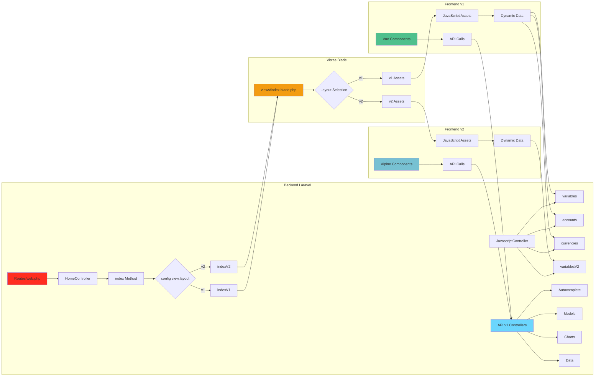

# Diagramas de Arquitectura - Firefly III Frontends

## Diagrama de Arquitectura General

## Diagrama de Flujo de Rutas y Navegación

## Diagrama de Componentes - Frontend v1

```mermaid
graph TB
    subgraph "Core Vue.js"
        A[app_vue.js] --> B[Vue I18n]
        A --> C[UIV Components]
        A --> D[Vue Runtime]
    end

    subgraph "Entradas de Build"
        E[app.js] --> F[Bootstrap]
        G[create_transaction.js] --> H[Formulario Transacciones]
        I[edit_transaction.js] --> J[Edición Transacciones]
        K[profile.js] --> L[Gestión Perfil]
    end

    subgraph "Componentes Especializados"
        M[webhooks/index.js] --> N[Webhooks List]
        O[webhooks/create.js] --> P[Webhook Create]
        Q[webhooks/edit.js] --> R[Webhook Edit]
        S[webhooks/show.js] --> T[Webhook Show]

        U[exchange-rates/index.js] --> V[Tasas Cambio List]
        W[exchange-rates/rates.js] --> X[Tasas Cambio Detail]

        Y[administrations/index.js] --> Z[Admin List]
        AA[administrations/edit.js] --> BB[Admin Edit]
    end

    subgraph "Componentes Vue"
        CC[components/] --> DD[Form Components]
        CC --> EE[Transaction Components]
        CC --> FF[Profile Components]
        CC --> GG[Webhook Components]
        CC --> HH[Exchange Rate Components]
        CC --> II[Administration Components]
    end

    A --> E
    A --> G
    A --> I
    A --> K
    A --> M
    A --> O
    A --> Q
    A --> S
    A --> U
    A --> W
    A --> Y
    A --> AA

    DD --> G
    EE --> H
    EE --> J
    FF --> L
    GG --> N
    GG --> P
    GG --> R
    GG --> T
    HH --> V
    HH --> X
    II --> Z
    II --> BB

    style A fill:#4fc08d
    style E fill:#41b883
    style M fill:#35495e
    style U fill:#ff6b6b
    style Y fill:#9b59b6
```

## Diagrama de Componentes - Frontend v2

```mermaid
graph TB
    subgraph "Core Alpine.js"
        A[boot/bootstrap.js] --> B[Alpine.js Init]
        B --> C[Event System]
        B --> D[Store Integration]
    end

    subgraph "Páginas Principales"
        E[dashboard/dashboard.js] --> F[Dashboard Principal]
        F --> G[boxes.js]
        F --> H[accounts.js]
        F --> I[budgets.js]
        F --> J[categories.js]
        F --> K[sankey.js]
        F --> L[subscriptions.js]
        F --> M[piggies.js]

        N[transactions/create.js] --> O[Crear Transacción]
        P[transactions/edit.js] --> Q[Editar Transacción]
        R[transactions/show.js] --> S[Mostrar Transacción]
        T[transactions/index.js] --> U[Listar Transacciones]

        V[accounts/index.js] --> W[Gestión Cuentas]

        X[administrations/index.js] --> Y[Listar Admin]
        Z[administrations/create.js] --> AA[Crear Admin]
        BB[administrations/edit.js] --> CC[Editar Admin]
    end

    subgraph "Sistema de Estado"
        DD[store/set-variable.js] --> EE[Persistir Estado]
        FF[store/get-variable.js] --> GG[Recuperar Estado]
        EE --> HH[Local Storage]
        GG --> HH
    end

    subgraph "Utilidades"
        II[support/page-settings/] --> JJ[Configuración UI]
        KK[util/] --> LL[Helpers]
        MM[libraries/] --> NN[Librerías Personalizadas]
    end

    subgraph "Gráficos Chart.js"
        OO[Chart.js Registry] --> PP[Line Charts]
        OO --> QQ[Bar Charts]
        OO --> RR[Pie Charts]
        OO --> SS[Sankey Charts]
    end

    A --> E
    A --> N
    A --> P
    A --> R
    A --> T
    A --> V
    A --> X
    A --> Z
    A --> BB

    DD --> F
    FF --> F

    II --> F
    KK --> F
    MM --> F

    OO --> K
    OO --> G

    style A fill:#77c1d2
    style E fill:#646cff
    style N fill:#41b883
    style V fill:#9b59b6
    style X fill:#e74c3c
    style DD fill:#f39c12
    style OO fill:#ff6b6b
```

## Diagrama de Proceso de Build

## Diagrama de Integración Backend-Frontend

## Diagrama de Gestión de Estado

```mermaid
graph TB
    subgraph "Frontend v1 - Vue.js State"
        A[Vue Components] --> B[Component Data]
        B --> C[Props]
        B --> D[Local State]

        E[Vuex Store] --> F[Global State]
        F --> G[Mutations]
        F --> H[Actions]

        I[Session Storage] --> J[Persistent Data]
        J --> K[User Preferences]
        K --> L[UI Settings]
    end

    subgraph "Frontend v2 - Alpine.js State"
        M[Alpine Components] --> N[Component Data]
        N --> O[Reactive Properties]
        N --> P[Local Methods]

        Q[Custom Store] --> R[set-variable.js]
        Q --> S[get-variable.js]
        R --> T[Persist State]
        S --> U[Retrieve State]

        V[Local Storage] --> W[Persistent Variables]
        W --> X[User Settings]
        X --> Y[App Configuration]
    end

    subgraph "Backend State"
        Z[Laravel Session] --> AA[User Session]
        AA --> BB[Auth State]
        BB --> CC[Permissions]

        DD[Database] --> EE[User Data]
        EE --> FF[Accounts]
        EE --> GG[Transactions]
        EE --> HH[Preferences]
    end

    A --> Z
    M --> Z

    I --> V

    style A fill:#4fc08d
    style M fill:#77c1d2
    style E fill:#35495e
    style Q fill:#f39c12
    style Z fill:#ff2d20
    style DD fill:#4479a7
```

## Resumen de Tecnologías por Frontend

### Frontend v1 - Tecnologías Legacy
- **Framework:** Vue.js 2.7
- **Build Tool:** Laravel Mix (Webpack)
- **CSS Framework:** Bootstrap 3
- **State Management:** Vuex
- **Internationalization:** Vue I18n
- **Icons:** Font Awesome 4
- **Charts:** Chart.js (integrado)

### Frontend v2 - Tecnologías Modernas
- **Framework:** Alpine.js 3.13
- **Build Tool:** Vite 7
- **CSS Framework:** Bootstrap 5
- **State Management:** Custom Store
- **Internationalization:** i18next
- **Icons:** Font Awesome Free
- **Charts:** Chart.js 4 + Sankey

### Tecnologías Compartidas
- **Backend:** Laravel 12
- **API:** REST API v1
- **Database:** Eloquent ORM
- **Authentication:** Laravel Sanctum
- **Testing:** PHPUnit + Jest

## Conclusión de Arquitectura

La arquitectura de Firefly III demuestra una evolución cuidadosa desde tecnologías legacy hacia soluciones modernas, manteniendo la compatibilidad y permitiendo una migración gradual. La coexistencia de v1 y v2 proporciona flexibilidad para diferentes necesidades y preferencias de los usuarios.

Los diagramas muestran cómo ambos frontends se integran eficientemente con el backend Laravel, compartiendo la misma API pero utilizando enfoques diferentes para la interfaz de usuario y la gestión de estado. Esta arquitectura híbrida asegura la estabilidad mientras se adoptan tecnologías modernas.