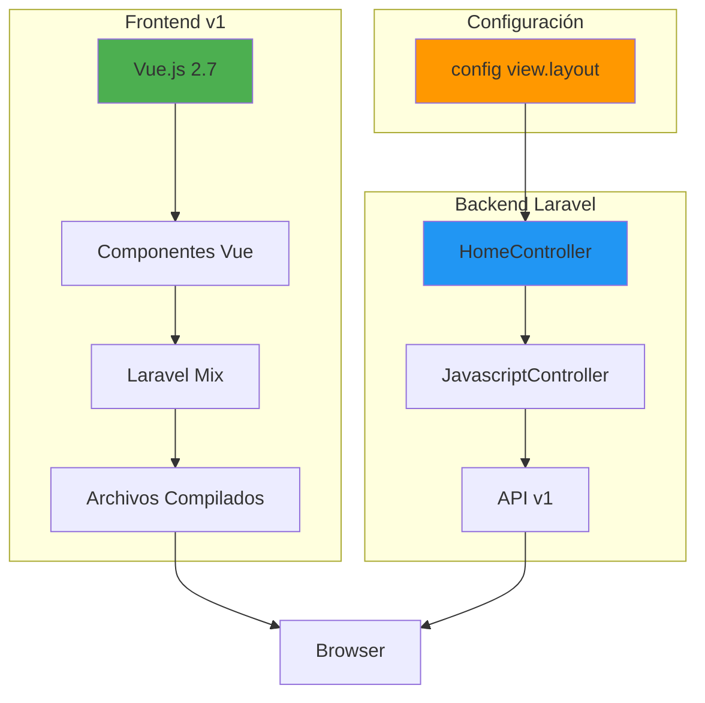

# Análisis del Frontend v1 - Firefly III

## Descripción General

El Frontend v1 de Firefly III es la interfaz de usuario legacy que utiliza tecnologías más antiguas pero estables. Esta versión sigue siendo completamente funcional y se mantiene para compatibilidad con instalaciones existentes.

### Stack Tecnológico

**Frameworks y Librerías Principales:**
- **Vue.js 2.7** - Framework de JavaScript para interfaces de usuario
- **Laravel Mix 6.0** - Herramienta de build basada en Webpack
- **Bootstrap 3** - Framework CSS para diseño responsivo
- **jQuery 3** - Librería JavaScript para manipulación DOM
- **Vue I18n 8** - Sistema de internacionalización para Vue
- **UIV** - Componentes UI para Vue.js

**Dependencias de Desarrollo:**
- `@johmun/vue-tags-input` - Componente de entrada de etiquetas
- `@vue/compiler-sfc` - Compilador de componentes Vue
- `bootstrap-sass` - Bootstrap con soporte Sass
- `font-awesome` - Iconografía
- `vue-loader` - Loader de Webpack para Vue
- `vue-template-compiler` - Compilador de templates Vue

**Dependencias de Producción:**
- `date-fns` - Manipulación de fechas
- `stream-browserify` - Polyfill para streams en navegador

## Estructura de Archivos y Directorios

```
resources/assets/v1/
├── build/                    # Archivos compilados
├── src/
│   ├── administrations/      # Gestión de administraciones
│   ├── components/           # Componentes Vue reutilizables
│   │   ├── administrations/  # Componentes de administraciones
│   │   ├── exchange-rates/   # Tasas de cambio
│   │   ├── form/             # Componentes de formulario
│   │   ├── passport/         # Autenticación
│   │   ├── profile/          # Perfil de usuario
│   │   ├── transactions/     # Transacciones
│   │   └── webhooks/         # Webhooks
│   ├── exchange-rates/       # Gestión de tasas de cambio
│   ├── locales/              # Archivos de localización
│   ├── webhooks/             # Gestión de webhooks
│   ├── app.js               # Bootstrap principal
│   ├── app_vue.js           # Configuración Vue.js
│   ├── bootstrap.js         # Configuración inicial
│   ├── create_transaction.js # Creación de transacciones
│   ├── edit_transaction.js  # Edición de transacciones
│   ├── i18n.js              # Configuración i18n
│   └── profile.js           # Gestión de perfil
├── package.json
├── webpack.mix.js           # Configuración de Laravel Mix
└── mix-manifest.json        # Manifest de archivos compilados
```

## Configuración y Setup

### Configuración de Build (webpack.mix.js)

La configuración de build utiliza Laravel Mix con las siguientes características:

```javascript
mix.webpackConfig({
    resolve: {
        alias: {
            'vue$': 'vue/dist/vue.runtime.common.js'
        },
        fallback: {
            "stream": require.resolve("stream-browserify"),
            "zlib": false,
            "https": false,
            "http": false
        }
    }
});
```

**Scripts de Build:**
- `npm run development` - Build de desarrollo
- `npm run watch` - Watch para cambios en desarrollo
- `npm run production` - Build de producción

### Configuración de Vue.js

El archivo `app_vue.js` configura Vue.js con:
- Vue I18n para internacionalización
- UIV para componentes UI
- Configuración global de Vue

## Rutas y Navegación

### Controllers Principales

**HomeController** (`app/Http/Controllers/HomeController.php`):
- Maneja la lógica de selección entre v1 y v2
- Implementa `indexV1()` para renderizar el dashboard legacy
- Gestiona rangos de fechas y configuración de frontpage

**JavascriptController** (`app/Http/Controllers/JavascriptController.php`):
- Proporciona datos dinámicos a JavaScript
- Endpoints para cuentas, monedas y variables
- Soporte para v1 y v2

### Rutas Específicas de v1

```php
// JavaScript endpoints para v1
Route::group(
    ['middleware' => 'user-full-auth', 'namespace' => 'FireflyIII\Http\Controllers', 'prefix' => 'v1/jscript', 'as' => 'javascript.'],
    static function (): void {
        Route::get('variables', ['uses' => 'JavascriptController@variables', 'as' => 'variables']);
        Route::get('accounts', ['uses' => 'JavascriptController@accounts', 'as' => 'accounts']);
        Route::get('currencies', ['uses' => 'JavascriptController@currencies', 'as' => 'currencies']);
    }
);
```

## Componentes Principales

### Estructura de Componentes Vue

**Componentes por Funcionalidad:**

1. **Transacciones**
   - `create_transaction.js` - Creación de transacciones
   - `edit_transaction.js` - Edición de transacciones
   - Componentes en `components/transactions/`

2. **Perfil**
   - `profile.js` - Gestión de perfil de usuario
   - Componentes en `components/profile/`

3. **Administraciones**
   - Componentes en `components/administrations/`
   - Scripts en `src/administrations/`

4. **Webhooks**
   - Componentes en `components/webhooks/`
   - Scripts en `src/webhooks/`

5. **Tasas de Cambio**
   - Componentes en `components/exchange-rates/`
   - Scripts en `src/exchange-rates/`

### Ejemplo de Componente Vue

```javascript
// app_vue.js - Configuración base
import Vue from 'vue';
import VueI18n from 'vue-i18n'
import * as uiv from 'uiv';

window.vuei18n = VueI18n;
window.uiv = uiv;
Vue.use(vuei18n);
Vue.use(uiv);
window.Vue = Vue;
```

## Proceso de Build y Deployment

### Desarrollo

1. **Setup inicial:**
   ```bash
   cd resources/assets/v1
   npm install
   ```

2. **Desarrollo:**
   ```bash
   npm run watch
   ```

3. **Build de desarrollo:**
   ```bash
   npm run development
   ```

### Producción

1. **Build optimizado:**
   ```bash
   npm run production
   ```

2. **Archivos de salida:**
   - Generados en `resources/assets/v1/build/`
   - Copiados a `public/v1/js/`

### Características de Build

- **Code Splitting:** Entradas separadas para diferentes funcionalidades
- **Vue 2 Support:** Configuración específica para Vue 2.7
- **Polyfills:** Soporte para streams en navegador
- **Internationalization:** Soporte completo para i18n

## Integración con Backend

### Comunicación con Laravel

**Endpoints de Datos:**
- `/v1/jscript/variables` - Variables de configuración
- `/v1/jscript/accounts` - Datos de cuentas
- `/v1/jscript/currencies` - Datos de monedas

**API REST:**
- Utiliza la API v1 de Firefly III
- Autenticación via Laravel Sanctum
- Transformers para formateo de datos

### Gestión de Estado

- **Estado Local:** Gestionado por Vue.js
- **Persistencia:** Session storage y cookies
- **Sincronización:** Actualizaciones en tiempo real via eventos

## Consideraciones de Mantenimiento

### Ventajas

- **Estabilidad:** Tecnologías probadas y estables
- **Compatibilidad:** Soporte para navegadores antiguos
- **Documentación:** Amplia documentación disponible
- **Comunidad:** Gran ecosistema de Vue 2

### Desventajas

- **Tecnologías Legacy:** Vue 2 está en mantenimiento
- **Performance:** Menos optimizado que v2
- **Modernidad:** Falta de características modernas
- **Evolución:** Limitado por tecnologías legacy

### Migración a v2

- **Compatibilidad:** v1 y v2 pueden coexistir
- **Configuración:** Controlada por `config('view.layout')`
- **Progresiva:** Migración funcionalidad por funcionalidad

## Diagrama de Arquitectura



## Conclusión

El Frontend v1 representa una implementación robusta y estable de la interfaz de usuario de Firefly III. Aunque utiliza tecnologías más antiguas, proporciona una experiencia de usuario completa y confiable para la gestión de finanzas personales. Su arquitectura modular y bien estructurada facilita el mantenimiento y la coexistencia con la versión más moderna v2.

La configuración de build con Laravel Mix, combinada con Vue.js 2 y Bootstrap 3, crea una base sólida para aplicaciones web financieras. La separación clara entre componentes y la integración eficiente con el backend Laravel hacen de v1 una opción viable para instalaciones que requieren estabilidad y compatibilidad.