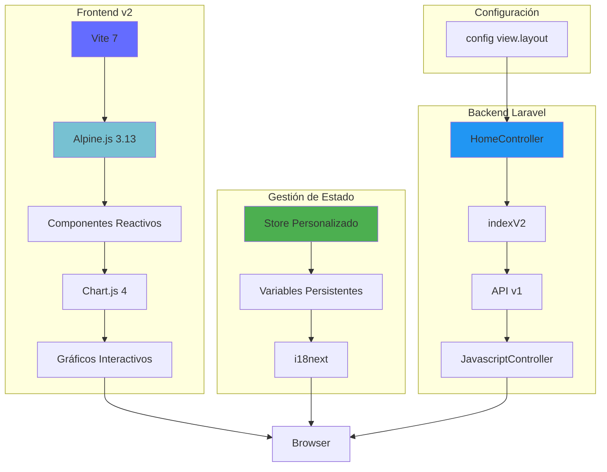

# Análisis del Frontend v2 - Firefly III

## Descripción General

El Frontend v2 de Firefly III representa la evolución moderna de la interfaz de usuario, utilizando tecnologías contemporáneas para ofrecer mejor rendimiento, experiencia de usuario y capacidades de desarrollo. Esta versión está diseñada para reemplazar gradualmente a v1.

### Stack Tecnológico

**Frameworks y Librerías Principales:**
- **Vite 7** - Herramienta de build moderna y rápida
- **Alpine.js 3.13.7** - Framework JavaScript minimalista
- **Bootstrap 5** - Framework CSS moderno
- **Chart.js 4** - Librería de gráficos
- **i18next 25.0.1** - Sistema de internacionalización
- **AdminLTE 4.0.0-rc4** - Template de administración

**Dependencias de Desarrollo:**
- `laravel-vite-plugin` - Integración Vite con Laravel
- `sass` - Preprocesador CSS
- `patch-package` - Parches para dependencias
- `vite-plugin-manifest-sri` - Plugin para SRI

**Dependencias de Producción:**
- `@fortawesome/fontawesome-free` - Iconografía moderna
- `@popperjs/core` - Posicionamiento de tooltips
- `bootstrap5-autocomplete` - Autocompletado
- `bootstrap5-tags` - Gestión de etiquetas
- `chartjs-adapter-date-fns` - Adaptador de fechas para Chart.js
- `chartjs-chart-sankey` - Gráficos Sankey
- `i18next-http-backend` - Backend HTTP para i18n
- `i18next-localstorage-backend` - Backend localStorage para i18n
- `leaflet` - Mapas interactivos
- `store` - Almacenamiento en navegador

## Estructura de Archivos y Directorios

```
resources/assets/v2/
├── src/
│   ├── api/                    # Clientes y configuraciones API
│   ├── boot/                   # Configuración de arranque
│   ├── css/                    # Estilos CSS
│   ├── libraries/              # Librerías personalizadas
│   ├── pages/                  # Páginas y componentes
│   │   ├── accounts/           # Gestión de cuentas
│   │   ├── administrations/    # Administraciones
│   │   ├── dashboard/          # Dashboard principal
│   │   ├── shared/             # Componentes compartidos
│   │   └── transactions/       # Transacciones
│   ├── sass/                   # Estilos Sass
│   ├── store/                  # Gestión de estado
│   ├── support/                # Utilidades de soporte
│   └── util/                   # Utilidades generales
├── package.json
└── vite.config.js             # Configuración de Vite
```

## Configuración y Setup

### Configuración de Build (vite.config.js)

La configuración utiliza Vite con las siguientes características avanzadas:

```javascript
export default defineConfig(({command, mode, isSsrBuild, isPreview}) => {
    return {
        base: './',
        build: {
            rollupOptions: {
                output: {
                    manualChunks,
                },
            }
        },
        plugins: [
            laravel({
                input: [
                    // CSS global
                    'src/sass/app.scss',
                    // Páginas principales
                    'src/pages/dashboard/dashboard.js',
                    'src/pages/accounts/index.js',
                    'src/pages/administrations/index.js',
                    'src/pages/administrations/create.js',
                    'src/pages/administrations/edit.js',
                    'src/pages/transactions/create.js',
                    'src/pages/transactions/edit.js',
                    'src/pages/transactions/show.js',
                    'src/pages/transactions/index.js',
                ],
                publicDirectory: '../../../public',
                refresh: true,
            }),
        ],
        server: {
            cors: true,
            origin: 'https://192.168.96.162:5173',
            watch: { usePolling: true },
            port: 5173,
            host: true,
            https: https,
        },
    }
});
```

**Características de Vite:**
- **HMR (Hot Module Replacement)** - Recarga en caliente
- **Code Splitting** - División automática de código
- **Tree Shaking** - Eliminación de código no utilizado
- **ES Modules** - Módulos ES nativos

### Scripts de Desarrollo

- `npm run dev` - Servidor de desarrollo con HMR
- `npm run build` - Build de producción
- `npm run postinstall` - Aplicación de parches

## Arquitectura de Componentes

### Enfoque Basado en Alpine.js

**Estructura de Componentes:**

```javascript
// dashboard.js - Ejemplo de componente Alpine.js
let index = function () {
    return {
        convertToPrimary: false,
        savePrimarySettings(event) {
            let target = event.currentTarget || event.target;
            setVariable('convert_to_primary', target.checked).then(() => {
                console.log('Set convert to primary to: ', target.checked);
                this.$dispatch('convert-to-primary', target.checked);
            });
        },
        init() {
            Promise.all([getVariable('convert_to_primary', false)]).then((values) => {
                this.convertToPrimary = values[0];
            });
        }
    }
};
```

### Páginas Principales

**Dashboard (`src/pages/dashboard/`):**
- `dashboard.js` - Componente principal
- `boxes.js` - Cajas informativas
- `accounts.js` - Gestión de cuentas
- `budgets.js` - Presupuestos
- `categories.js` - Categorías
- `sankey.js` - Gráficos Sankey
- `subscriptions.js` - Suscripciones
- `piggies.js` - Huchas

**Transacciones (`src/pages/transactions/`):**
- `create.js` - Creación de transacciones
- `edit.js` - Edición de transacciones
- `show.js` - Visualización de transacciones
- `index.js` - Listado de transacciones

**Cuentas (`src/pages/accounts/`):**
- `index.js` - Gestión de cuentas

**Administraciones (`src/pages/administrations/`):**
- `index.js` - Listado de administraciones
- `create.js` - Creación de administraciones
- `edit.js` - Edición de administraciones

## Gestión de Estado

### Store Personalizado

**Sistema de Variables (`src/store/`):**
- `set-variable.js` - Establecer variables
- `get-variable.js` - Obtener variables

**Ejemplo de Uso:**
```javascript
import { setVariable } from "../../store/set-variable.js";
import { getVariable } from "../../store/get-variable.js";

// Establecer variable
setVariable('convert_to_primary', true).then(() => {
    console.log('Variable guardada');
});

// Obtener variable
getVariable('convert_to_primary', false).then((value) => {
    console.log('Valor obtenido:', value);
});
```

### Internacionalización (i18n)

**Configuración i18next:**
- Backend HTTP para carga dinámica
- Backend localStorage para caché
- Soporte para múltiples idiomas
- Cambio dinámico de idioma

## Integración con Backend

### Comunicación con Laravel

**Endpoints Específicos de v2:**
```php
// JavaScript endpoints para v2
Route::group(
    ['middleware' => 'user-full-auth', 'namespace' => 'FireflyIII\Http\Controllers', 'prefix' => 'v2/jscript', 'as' => 'javascript.v2.'],
    static function (): void {
        Route::get('variables', ['uses' => 'JavascriptController@variablesV2', 'as' => 'variables']);
    }
);
```

**API REST v1:**
- Utiliza la misma API que v1
- Endpoints en `/api/v1/`
- Autenticación via Laravel Sanctum

### Controladores

**HomeController - indexV2():**
```php
private function indexV2(): mixed
{
    $subTitle  = (string) trans('firefly.welcome_back');
    $pageTitle = (string) trans('firefly.main_dashboard_page_title');

    $start     = session('start', today(config('app.timezone'))->startOfMonth());
    $end       = session('end', today(config('app.timezone'))->endOfMonth());

    /** @var User $user */
    $user      = auth()->user();
    event(new RequestedVersionCheckStatus($user));

    return view('index', compact('subTitle', 'start', 'end', 'pageTitle'));
}
```

## Visualización y Gráficos

### Chart.js Integration

**Configuración de Gráficos:**
```javascript
import {
    ArcElement, BarController, BarElement, CategoryScale, Chart,
    Colors, Filler, Legend, LinearScale, LineController, LineElement,
    PieController, PointElement, TimeScale, Tooltip
} from "chart.js";
import 'chartjs-adapter-date-fns';

// Registro de componentes
Chart.register({
    LineController, LineElement, ArcElement, BarController, TimeScale,
    PieController, BarElement, Filler, Colors, LinearScale, CategoryScale,
    PointElement, Tooltip, Legend
});
```

**Tipos de Gráficos Soportados:**
- Líneas para tendencias temporales
- Barras para comparaciones
- Pie para distribuciones
- Sankey para flujos financieros

## Proceso de Desarrollo

### Desarrollo Local

1. **Configuración inicial:**
   ```bash
   cd resources/assets/v2
   npm install
   ```

2. **Servidor de desarrollo:**
   ```bash
   npm run dev
   ```
   - Servidor en `https://192.168.96.162:5173`
   - HMR activado
   - Recarga automática

3. **Build de producción:**
   ```bash
   npm run build
   ```

### Características de Desarrollo

- **Hot Module Replacement** - Cambios instantáneos
- **Source Maps** - Depuración fácil
- **ES Modules** - Módulos nativos
- **Tree Shaking** - Builds optimizados

## Ventajas y Mejoras sobre v1

### Rendimiento

- **Build más rápido** - Vite vs Webpack
- **Carga más rápida** - ES Modules nativos
- **Menos código** - Alpine.js vs Vue.js
- **Mejor HMR** - Recarga en caliente instantánea

### Experiencia de Desarrollador

- **Configuración simplificada** - Vite vs Laravel Mix
- **Desarrollo más rápido** - HMR mejorado
- **Mejor debugging** - Source maps nativos
- **Módulos modernos** - ES Modules

### Experiencia de Usuario

- **Interfaz más moderna** - Bootstrap 5 vs 3
- **Iconografía mejorada** - Font Awesome Free
- **Gráficos avanzados** - Chart.js 4
- **Componentes modernos** - Alpine.js reactivo

## Diagrama de Arquitectura



## Consideraciones de Migración

### Coexistencia con v1

- **Selección por configuración:** `config('view.layout')`
- **Rutas separadas:** `/v1/jscript/` vs `/v2/jscript/`
- **Assets independientes:** `public/v1/` vs `public/v2/`

### Estrategia de Migración

1. **Funcionalidad por funcionalidad**
2. **Testing exhaustivo**
3. **Rollback fácil**
4. **Feedback de usuarios**

## Conclusión

El Frontend v2 representa la evolución moderna de Firefly III hacia tecnologías web contemporáneas. Con Vite como herramienta de build, Alpine.js para reactividad y Bootstrap 5 para diseño, ofrece mejoras significativas en rendimiento, experiencia de desarrollo y capacidades de usuario.

La arquitectura modular, el sistema de gestión de estado personalizado y la integración avanzada de gráficos hacen de v2 una base sólida para el futuro desarrollo de Firefly III. La coexistencia con v1 permite una migración gradual y controlada, asegurando la estabilidad mientras se adoptan tecnologías modernas.

La combinación de Alpine.js para lógica de interfaz, Chart.js para visualizaciones y i18next para internacionalización crea una experiencia de usuario rica y responsive que se alinea con las expectativas modernas de aplicaciones web financieras.