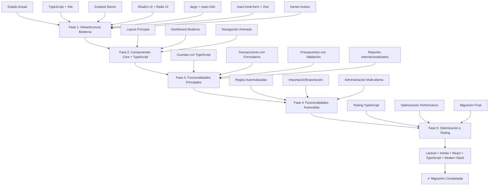

# Plan de Migración: Firefly III de Monolito a Laravel + InertiaJS 2 + React + TypeScript

## Resumen Ejecutivo

Este documento detalla un plan integral de migración para transformar Firefly III desde su arquitectura monolítica actual hacia una arquitectura moderna utilizando Laravel 12 como backend, InertiaJS 2 como capa de integración, React con TypeScript como framework frontend, y un stack tecnológico moderno que incluye Zustand para state management, Shadcn UI para componentes, dayjs para fechas, react-i18n para internacionalización, react-hook-form para formularios, y framer-motion para animaciones. La migración se realizará de forma incremental preservando la funcionalidad existente mientras se moderniza la experiencia de usuario.

## Análisis del Estado Actual

### Arquitectura Actual
- **Backend**: Laravel 12 con PHP 8.4+
- **Frontend Dual**:
  - **v1 (Legacy)**: Laravel Mix + Vue 2 + Bootstrap 3
  - **v2 (Moderno)**: Vite + AlpineJS + Bootstrap 5
- **Base de Datos**: MySQL/PostgreSQL/SQLite
- **Autenticación**: Laravel Sanctum + Passport
- **API**: REST JSON API completa

### Stack Tecnológico Propuesto para v3
- **Frontend Framework**: React 18 + TypeScript
- **State Management**: Zustand (lightweight stores)
- **UI Components**: Shadcn UI + Radix UI (accessible components)
- **Date Handling**: dayjs (lightweight date library)
- **Internationalization**: react-i18n (i18next)
- **Forms**: react-hook-form + Zod validation
- **Animations**: framer-motion
- **Styling**: Tailwind CSS + CSS Modules
- **Build Tool**: Vite 7
- **Type Safety**: TypeScript strict mode

### Estructura de Frontend Actual
```
resources/assets/
├── v1/ (Legacy - Vue 2)
│   ├── webpack.mix.js
│   ├── src/
│   │   ├── app.js (jQuery/Bootstrap)
│   │   ├── app_vue.js (Vue 2)
│   │   └── components/ (Vue 2 components)
├── v2/ (Modern - AlpineJS)
│   ├── vite.config.js
│   ├── src/
│   │   ├── pages/ (AlpineJS pages)
│   │   ├── api/ (API clients)
│   │   └── store/ (State management)
└── v3/ (Nuevo - React + TypeScript + Modern Stack)
    ├── package.json (TypeScript + modern dependencies)
    ├── tsconfig.json
    ├── vite.config.ts
    ├── src/
    │   ├── main.tsx (entry point)
    │   ├── types/ (TypeScript definitions)
    │   ├── stores/ (Zustand stores)
    │   ├── components/ (Shadcn UI + custom components)
    │   ├── pages/ (Inertia pages)
    │   ├── hooks/ (custom hooks)
    │   ├── utils/ (utilities: dayjs, formatting, etc.)
    │   ├── locales/ (i18n files)
    │   └── lib/ (configuration: theme, router, etc.)
    └── styles/
        ├── globals.css
        └── components.css
```

### Controladores y Rutas
- **140+ controladores** organizados por funcionalidad
- **Sistema de rutas complejo** con middleware de autenticación
- **Dualidad de vistas** (v1/v2) en controladores como HomeController

## Objetivos de la Migración

### Objetivos Principales
1. **Unificar frontend** eliminando la dualidad v1/v2
2. **Modernizar experiencia de usuario** con React
3. **Mantener compatibilidad** con API existente
4. **Preservar funcionalidad** durante la transición
5. **Mejorar mantenibilidad** y desarrollo futuro

### Beneficios Esperados
- **Type Safety**: Detección temprana de errores con TypeScript
- **Developer Experience**: Mejor autocompletado y refactoring
- **Performance**: Zustand es más ligero que Redux
- **UX**: Animaciones suaves y componentes accesibles
- **Maintainability**: Código más predecible y testeable
- **Internationalization**: Soporte nativo para múltiples idiomas
- **Modern Forms**: Validación robusta con react-hook-form + Zod
- **Consistent UI**: Sistema de diseño unificado con Shadcn UI
- **Date Handling**: Manejo eficiente de fechas con dayjs

## Plan de Migración Detallado

### Fase 1: Preparación e Infraestructura (Semanas 1-3)

#### 1.1 Configuración de InertiaJS 2 y Stack Moderno
```bash
# Instalar dependencias de InertiaJS
composer require inertiajs/inertia-laravel

# Agregar v3 al workspace principal (package.json)
# Agregar "resources/assets/v3" al array de workspaces

# Instalar dependencias completas para v3
cd resources/assets/v3
npm install @inertiajs/react react react-dom @vitejs/plugin-react laravel-vite-plugin
npm install typescript @types/react @types/react-dom
npm install zustand
npm install @radix-ui/react-colors @radix-ui/react-dialog @radix-ui/react-dropdown-menu
npm install class-variance-authority tailwind-merge tailwindcss-animate lucide-react
npm install dayjs
npm install react-i18next i18next
npm install react-hook-form @hookform/resolvers zod
npm install framer-motion
npm install clsx

# Comandos de desarrollo para v3
npm run dev    # Servidor de desarrollo
npm run build  # Build de producción
npm run type-check  # Verificación de tipos TypeScript
```

#### 1.2 Configuración de Vite para React + TypeScript
```typescript
// resources/assets/v3/vite.config.ts
import { defineConfig } from 'vite'
import laravel from 'laravel-vite-plugin'
import react from '@vitejs/plugin-react'

export default defineConfig({
  plugins: [
    laravel({
      input: ['resources/assets/v3/src/main.tsx'],
      refresh: true,
    }),
    react(),
  ],
  resolve: {
    alias: {
      '@': '/resources/assets/v3/src',
    },
  },
})
```

#### 1.3 Configuración de TypeScript
```json
// resources/assets/v3/tsconfig.json
{
  "compilerOptions": {
    "target": "ES2020",
    "useDefineForClassFields": true,
    "lib": ["ES2020", "DOM", "DOM.Iterable"],
    "module": "ESNext",
    "skipLibCheck": true,
    "moduleResolution": "bundler",
    "allowImportingTsExtensions": true,
    "resolveJsonModule": true,
    "isolatedModules": true,
    "noEmit": true,
    "jsx": "react-jsx",
    "strict": true,
    "noUnusedLocals": true,
    "noUnusedParameters": true,
    "noFallthroughCasesInSwitch": true,
    "baseUrl": ".",
    "paths": {
      "@/*": ["./src/*"]
    }
  },
  "include": ["src"],
  "references": [{ "path": "./tsconfig.node.json" }]
}
```

#### 1.4 Middleware de Inertia
```php
// app/Http/Middleware/HandleInertiaRequests.php
class HandleInertiaRequests extends Middleware
{
    public function share(Request $request): array
    {
        return array_merge(parent::share($request), [
            'auth' => [
                'user' => $request->user(),
            ],
            'flash' => [
                'message' => fn () => $request->session()->get('message'),
            ],
        ])
    }
}
```

#### 1.5 Configuración de Zustand Stores
```typescript
// resources/assets/v3/src/stores/appStore.ts
import { create } from 'zustand'
import { persist } from 'zustand/middleware'

interface AppState {
  user: User | null
  preferences: UserPreferences
  isLoading: boolean
  setUser: (user: User | null) => void
  updatePreferences: (preferences: Partial<UserPreferences>) => void
  setLoading: (loading: boolean) => void
}

export const useAppStore = create<AppState>()(
  persist(
    (set) => ({
      user: null,
      preferences: {
        theme: 'light',
        currency: 'USD',
        dateFormat: 'YYYY-MM-DD',
        language: 'en',
      },
      isLoading: false,
      setUser: (user) => set({ user }),
      updatePreferences: (preferences) =>
        set((state) => ({ preferences: { ...state.preferences, ...preferences } })),
      setLoading: (isLoading) => set({ isLoading }),
    }),
    {
      name: 'firefly-app-storage',
    }
  )
)

// Store especializado para cuentas
interface AccountsState {
  accounts: Account[]
  selectedAccount: Account | null
  filters: AccountFilters
  loadAccounts: () => Promise<void>
  createAccount: (account: CreateAccountData) => Promise<void>
  updateAccount: (id: string, updates: Partial<Account>) => Promise<void>
  deleteAccount: (id: string) => Promise<void>
}

export const useAccountsStore = create<AccountsState>((set, get) => ({
  accounts: [],
  selectedAccount: null,
  filters: {},
  loadAccounts: async () => {
    const response = await axios.get('/api/v1/accounts')
    set({ accounts: response.data })
  },
  createAccount: async (accountData) => {
    const response = await axios.post('/api/v1/accounts', accountData)
    set((state) => ({ accounts: [...state.accounts, response.data] }))
  },
  updateAccount: async (id, updates) => {
    const response = await axios.put(`/api/v1/accounts/${id}`, updates)
    set((state) => ({
      accounts: state.accounts.map(account =>
        account.id === id ? response.data : account
      )
    }))
  },
  deleteAccount: async (id) => {
    await axios.delete(`/api/v1/accounts/${id}`)
    set((state) => ({
      accounts: state.accounts.filter(account => account.id !== id)
    }))
  },
}))
```

#### 1.6 Estructura de Directorios React + TypeScript
```
resources/assets/v3/
├── package.json (TypeScript + modern dependencies)
├── tsconfig.json
├── vite.config.ts
├── src/
│   ├── main.tsx (entry point)
│   ├── types/
│   │   ├── account.ts
│   │   ├── transaction.ts
│   │   ├── budget.ts
│   │   ├── user.ts
│   │   └── index.ts
│   ├── stores/
│   │   ├── appStore.ts
│   │   ├── accountsStore.ts
│   │   ├── transactionsStore.ts
│   │   ├── budgetsStore.ts
│   │   └── index.ts
│   ├── components/
│   │   ├── ui/ (Shadcn UI components)
│   │   │   ├── button.tsx
│   │   │   ├── card.tsx
│   │   │   ├── input.tsx
│   │   │   └── ...
│   │   ├── forms/ (Custom form components)
│   │   │   ├── AccountForm.tsx
│   │   │   ├── TransactionForm.tsx
│   │   │   └── ...
│   │   ├── charts/ (Financial charts)
│   │   └── layout/ (Layout components)
│   ├── pages/ (Inertia pages)
│   │   ├── Dashboard/
│   │   ├── Accounts/
│   │   ├── Transactions/
│   │   └── ...
│   ├── hooks/
│   │   ├── useDashboardData.ts
│   │   ├── useAccounts.ts
│   │   └── ...
│   ├── utils/
│   │   ├── date.ts (dayjs utilities)
│   │   ├── currency.ts
│   │   ├── validation.ts (Zod schemas)
│   │   └── ...
│   ├── locales/
│   │   ├── en/
│   │   ├── es/
│   │   └── ...
│   └── lib/
│       ├── theme.ts (Radix UI colors)
│       ├── i18n.ts (react-i18n config)
│       └── ...
└── styles/
    ├── globals.css
    ├── components.css
    └── tailwind.css
```

#### 1.7 Configuración de Workspace NPM

**Ventajas de la estructura con workspaces:**
- ✅ **Total independencia** de v1 y v2 durante el desarrollo
- ✅ **Dependencias específicas** sin conflictos entre versiones
- ✅ **Builds separados** para cada frontend
- ✅ **Compatibilidad total** con la arquitectura existente
- ✅ **Mantenimiento individual** por versión
- ✅ **Testing independiente** de cada frontend

```json
// package.json principal (raíz del proyecto)
{
  "scripts": {
    "postinstall": "patch-package --error-on-fail"
  },
  "workspaces": [
    "resources/assets/v1",
    "resources/assets/v2",
    "resources/assets/v3"
  ],
  "devDependencies": {
    "postcss": "^8.4.47"
  }
}
```

```json
// resources/assets/v3/package.json
{
  "name": "v3",
  "private": true,
  "type": "module",
  "scripts": {
    "dev": "vite",
    "build": "tsc && vite build --emptyOutDir",
    "type-check": "tsc --noEmit",
    "postinstall": "patch-package --error-on-fail"
  },
  "dependencies": {
    "react": "^18.0.0",
    "react-dom": "^18.0.0",
    "@inertiajs/react": "^2.0.0",
    "zustand": "^4.0.0",
    "dayjs": "^1.0.0",
    "react-i18next": "^13.0.0",
    "i18next": "^23.0.0",
    "clsx": "^2.0.0",
    "react-hook-form": "^7.0.0",
    "@hookform/resolvers": "^3.0.0",
    "zod": "^3.0.0",
    "framer-motion": "^11.0.0",
    "@radix-ui/react-colors": "^1.0.0",
    "@radix-ui/react-dialog": "^1.0.0",
    "@radix-ui/react-dropdown-menu": "^2.0.0",
    "class-variance-authority": "^0.7.0",
    "tailwind-merge": "^2.0.0",
    "tailwindcss-animate": "^1.0.0",
    "lucide-react": "^0.0.0"
  },
  "devDependencies": {
    "@types/react": "^18.0.0",
    "@types/react-dom": "^18.0.0",
    "@vitejs/plugin-react": "^4.0.0",
    "laravel-vite-plugin": "^2.0.0",
    "typescript": "^5.0.0",
    "vite": "^7.0.0",
    "tailwindcss": "^3.0.0",
    "autoprefixer": "^10.0.0",
    "postcss": "^8.0.0",
    "patch-package": "^8.0.0"
  }
}
```

### Fase 2: Migración de Componentes Core (Semanas 3-10)

#### 2.1 Layout Principal con TypeScript y Shadcn UI
```tsx
// resources/assets/v3/src/components/layout/AppLayout.tsx
import { Head, Link } from '@inertiajs/react'
import { motion } from 'framer-motion'
import { useTranslation } from 'react-i18next'
import { useAppStore } from '@/stores/appStore'
import { Header } from './Header'
import { Sidebar } from './Sidebar'
import { Footer } from './Footer'
import { Breadcrumbs } from './Breadcrumbs'

interface AppLayoutProps {
  children: React.ReactNode
  title?: string
}

export default function AppLayout({ children, title }: AppLayoutProps) {
  const { t } = useTranslation()
  const { preferences } = useAppStore()

  return (
    <motion.div
      initial={{ opacity: 0 }}
      animate={{ opacity: 1 }}
      transition={{ duration: 0.3 }}
      className={`app-wrapper theme-${preferences.theme}`}
    >
      <Head title={title || t('app.title')} />
      <Header />
      <Sidebar />
      <main className="app-main">
        <div className="app-content-header">
          <Breadcrumbs />
        </div>
        <motion.div
          initial={{ y: 20, opacity: 0 }}
          animate={{ y: 0, opacity: 1 }}
          transition={{ duration: 0.4 }}
          className="app-content"
        >
          {children}
        </motion.div>
      </main>
      <Footer />
    </motion.div>
  )
}
```

#### 2.2 Dashboard con TypeScript y Estado Moderno
```tsx
// resources/assets/v3/src/pages/Dashboard/Index.tsx
import AppLayout from '@/components/layout/AppLayout'
import { Head } from '@inertiajs/react'
import { useTranslation } from 'react-i18next'
import { useAccountsStore } from '@/stores/accountsStore'
import { useDashboardData } from '@/hooks/useDashboardData'
import { DashboardBoxes } from './components/DashboardBoxes'
import { AccountChart } from './components/AccountChart'
import { BudgetChart } from './components/BudgetChart'
import { CategoryChart } from './components/CategoryChart'
import { AccountList } from './components/AccountList'
import { SankeyChart } from './components/SankeyChart'
import { Card, CardContent, CardHeader, CardTitle } from '@/components/ui/card'
import { motion } from 'framer-motion'

interface DashboardProps {
  accounts: Account[]
  budgets: Budget[]
  categories: Category[]
  startDate: string
  endDate: string
}

export default function Dashboard({ accounts, budgets, categories, startDate, endDate }: DashboardProps) {
  const { t } = useTranslation()
  const { loadAccounts } = useAccountsStore()
  const { data: dashboardData, loading } = useDashboardData(startDate, endDate)

  // Cargar datos adicionales si es necesario
  React.useEffect(() => {
    loadAccounts()
  }, [loadAccounts])

  const containerVariants = {
    hidden: { opacity: 0 },
    visible: {
      opacity: 1,
      transition: {
        staggerChildren: 0.1
      }
    }
  }

  const itemVariants = {
    hidden: { y: 20, opacity: 0 },
    visible: {
      y: 0,
      opacity: 1,
      transition: { duration: 0.5 }
    }
  }

  return (
    <AppLayout title={t('dashboard.title')}>
      <Head title={t('dashboard.title')} />

      <motion.div
        variants={containerVariants}
        initial="hidden"
        animate="visible"
        className="space-y-6"
      >
        <motion.div variants={itemVariants}>
          <DashboardBoxes
            accounts={accounts}
            startDate={startDate}
            endDate={endDate}
            loading={loading}
          />
        </motion.div>

        <div className="grid grid-cols-1 lg:grid-cols-3 gap-6">
          <motion.div variants={itemVariants} className="lg:col-span-2 space-y-6">
            <Card>
              <CardHeader>
                <CardTitle>{t('dashboard.account_chart')}</CardTitle>
              </CardHeader>
              <CardContent>
                <AccountChart accounts={accounts} />
              </CardContent>
            </Card>

            <Card>
              <CardHeader>
                <CardTitle>{t('dashboard.budget_chart')}</CardTitle>
              </CardHeader>
              <CardContent>
                <BudgetChart budgets={budgets} />
              </CardContent>
            </Card>

            <Card>
              <CardHeader>
                <CardTitle>{t('dashboard.category_chart')}</CardTitle>
              </CardHeader>
              <CardContent>
                <CategoryChart categories={categories} />
              </CardContent>
            </Card>
          </motion.div>

          <motion.div variants={itemVariants} className="space-y-6">
            <Card>
              <CardHeader>
                <CardTitle>{t('dashboard.accounts')}</CardTitle>
              </CardHeader>
              <CardContent>
                <AccountList accounts={accounts} />
              </CardContent>
            </Card>
          </motion.div>
        </div>

        <motion.div variants={itemVariants}>
          <Card>
            <CardHeader>
              <CardTitle>{t('dashboard.cash_flow')}</CardTitle>
            </CardHeader>
            <CardContent>
              <SankeyChart
                accounts={accounts}
                startDate={startDate}
                endDate={endDate}
              />
            </CardContent>
          </Card>
        </motion.div>
      </motion.div>
    </AppLayout>
  )
}
```

#### 2.3 Controlador Adaptado
```php
// app/Http/Controllers/DashboardController.php
class DashboardController extends Controller
{
    public function index(): Response
    {
        $startDate = session('start', today()->startOfMonth());
        $endDate = session('end', today()->endOfMonth());

        $accounts = $this->getDashboardAccounts();
        $budgets = $this->getDashboardBudgets();
        $categories = $this->getDashboardCategories();

        return Inertia::render('Dashboard/Index', [
            'accounts' => $accounts,
            'budgets' => $budgets,
            'categories' => $categories,
            'startDate' => $startDate->format('Y-m-d'),
            'endDate' => $endDate->format('Y-m-d'),
        ]);
    }
}
```

## Implementación de Tecnologías Modernas

### TypeScript para Type Safety

#### Definición de Tipos para Modelos Principales
```typescript
// resources/assets/v3/src/types/account.ts
export interface Account {
  id: string
  name: string
  type: AccountType
  balance: number
  currency: Currency
  created_at: string
  updated_at: string
}

export interface CreateAccountData {
  name: string
  type: AccountType
  currency: string
  opening_balance?: number
  opening_balance_date?: string
}

// resources/assets/v3/src/types/transaction.ts
export interface Transaction {
  id: string
  description: string
  amount: number
  date: string
  account_id: string
  category_id?: string
  budget_id?: string
  splits?: TransactionSplit[]
}

export interface TransactionSplit {
  id: string
  amount: number
  description: string
  category_id?: string
  budget_id?: string
}

// resources/assets/v3/src/types/index.ts
export * from './account'
export * from './transaction'
export * from './budget'
export * from './user'
```

#### Tipos para API Responses
```typescript
// resources/assets/v3/src/types/api.ts
export interface ApiResponse<T> {
  data: T
  meta?: {
    current_page: number
    total: number
    per_page: number
    last_page: number
  }
}

export interface PaginatedResponse<T> extends ApiResponse<T[]> {
  meta: {
    current_page: number
    total: number
    per_page: number
    last_page: number
  }
}
```

### Zustand para State Management

#### Store Centralizado de Aplicación
```typescript
// resources/assets/v3/src/stores/appStore.ts
import { create } from 'zustand'
import { persist } from 'zustand/middleware'

interface AppState {
  user: User | null
  preferences: UserPreferences
  isLoading: boolean
  notifications: Notification[]
  setUser: (user: User | null) => void
  updatePreferences: (preferences: Partial<UserPreferences>) => void
  setLoading: (loading: boolean) => void
  addNotification: (notification: Omit<Notification, 'id' | 'timestamp'>) => void
  removeNotification: (id: string) => void
}

export const useAppStore = create<AppState>()(
  persist(
    (set, get) => ({
      user: null,
      preferences: {
        theme: 'light',
        currency: 'USD',
        dateFormat: 'YYYY-MM-DD',
        language: 'en',
      },
      isLoading: false,
      notifications: [],
      setUser: (user) => set({ user }),
      updatePreferences: (preferences) =>
        set((state) => ({ preferences: { ...state.preferences, ...preferences } })),
      setLoading: (isLoading) => set({ isLoading }),
      addNotification: (notification) =>
        set((state) => ({
          notifications: [
            ...state.notifications,
            {
              ...notification,
              id: Math.random().toString(36).substr(2, 9),
              timestamp: new Date().toISOString(),
            },
          ],
        })),
      removeNotification: (id) =>
        set((state) => ({
          notifications: state.notifications.filter((n) => n.id !== id),
        })),
    }),
    {
      name: 'firefly-app-storage',
    }
  )
)
```

#### Store Especializado para Transacciones
```typescript
// resources/assets/v3/src/stores/transactionsStore.ts
import { create } from 'zustand'

interface TransactionsState {
  transactions: Transaction[]
  selectedTransaction: Transaction | null
  filters: TransactionFilters
  pagination: Pagination
  loadTransactions: (filters?: TransactionFilters) => Promise<void>
  createTransaction: (transaction: CreateTransactionData) => Promise<void>
  updateTransaction: (id: string, updates: Partial<Transaction>) => Promise<void>
  deleteTransaction: (id: string) => Promise<void>
  setSelectedTransaction: (transaction: Transaction | null) => void
  updateFilters: (filters: Partial<TransactionFilters>) => void
}

export const useTransactionsStore = create<TransactionsState>((set, get) => ({
  transactions: [],
  selectedTransaction: null,
  filters: {},
  pagination: {
    current_page: 1,
    total: 0,
    per_page: 25,
    last_page: 1,
  },
  loadTransactions: async (filters = {}) => {
    const params = new URLSearchParams()
    Object.entries(filters).forEach(([key, value]) => {
      if (value !== undefined && value !== null) {
        params.append(key, value.toString())
      }
    })

    const response = await axios.get(`/api/v1/transactions?${params}`)
    set({
      transactions: response.data.data,
      pagination: response.data.meta
    })
  },
  createTransaction: async (transactionData) => {
    const response = await axios.post('/api/v1/transactions', transactionData)
    set((state) => ({ transactions: [...state.transactions, response.data] }))
  },
  updateTransaction: async (id, updates) => {
    const response = await axios.put(`/api/v1/transactions/${id}`, updates)
    set((state) => ({
      transactions: state.transactions.map(transaction =>
        transaction.id === id ? response.data : transaction
      )
    }))
  },
  deleteTransaction: async (id) => {
    await axios.delete(`/api/v1/transactions/${id}`)
    set((state) => ({
      transactions: state.transactions.filter(transaction => transaction.id !== id)
    }))
  },
  setSelectedTransaction: (transaction) => set({ selectedTransaction: transaction }),
  updateFilters: (filters) => set((state) => ({
    filters: { ...state.filters, ...filters }
  })),
}))
```

### Shadcn UI + Radix UI para Componentes Accesibles

#### Tema Personalizado para Firefly III
```typescript
// resources/assets/v3/src/lib/theme.ts
export const fireflyTheme = {
  colors: {
    primary: {
      50: '#f0f9ff',
      100: '#e0f2fe',
      200: '#bae6fd',
      300: '#7dd3fc',
      400: '#38bdf8',
      500: '#0ea5e9',
      600: '#0284c7',
      700: '#0369a1',
      800: '#075985',
      900: '#0c4a6e',
    },
    success: {
      500: '#10b981',
    },
    warning: {
      500: '#f59e0b',
    },
    danger: {
      500: '#ef4444',
    }
  }
}

// Componente de botón personalizado
import { cva, type VariantProps } from 'class-variance-authority'
import { cn } from '@/lib/utils'

const buttonVariants = cva(
  'inline-flex items-center justify-center rounded-md text-sm font-medium transition-colors focus-visible:outline-none focus-visible:ring-2 focus-visible:ring-ring focus-visible:ring-offset-2 disabled:opacity-50 disabled:pointer-events-none ring-offset-background',
  {
    variants: {
      variant: {
        default: 'bg-primary text-primary-foreground hover:bg-primary/90',
        destructive: 'bg-destructive text-destructive-foreground hover:bg-destructive/90',
        outline: 'border border-input hover:bg-accent hover:text-accent-foreground',
        secondary: 'bg-secondary text-secondary-foreground hover:bg-secondary/80',
        ghost: 'hover:bg-accent hover:text-accent-foreground',
        link: 'underline-offset-4 hover:underline text-primary',
      },
      size: {
        default: 'h-10 py-2 px-4',
        sm: 'h-9 px-3 rounded-md',
        lg: 'h-11 px-8 rounded-md',
      },
    },
    defaultVariants: {
      variant: 'default',
      size: 'default',
    },
  }
)

export interface ButtonProps
  extends React.ButtonHTMLAttributes<HTMLButtonElement>,
    VariantProps<typeof buttonVariants> {}

const Button = React.forwardRef<HTMLButtonElement, ButtonProps>(
  ({ className, variant, size, ...props }, ref) => {
    return (
      <button
        className={cn(buttonVariants({ variant, size, className }))}
        ref={ref}
        {...props}
      />
    )
  }
)
Button.displayName = 'Button'

export { Button, buttonVariants }
```

### dayjs para Manejo de Fechas

#### Utilidades de Fecha para Finanzas
```typescript
// resources/assets/v3/src/utils/date.ts
import dayjs from 'dayjs'
import 'dayjs/locale/en'
import 'dayjs/locale/es'
import 'dayjs/locale/fr'
import 'dayjs/locale/de'
import relativeTime from 'dayjs/plugin/relativeTime'
import isBetween from 'dayjs/plugin/isBetween'

dayjs.extend(relativeTime)
dayjs.extend(isBetween)

export const financialDateUtils = {
  formatTransactionDate: (date: string, locale = 'en') =>
    dayjs(date).locale(locale).format('MMM DD, YYYY'),

  formatMonthYear: (date: string, locale = 'en') =>
    dayjs(date).locale(locale).format('MMMM YYYY'),

  getMonthRange: (date: string) => ({
    start: dayjs(date).startOf('month').format('YYYY-MM-DD'),
    end: dayjs(date).endOf('month').format('YYYY-MM-DD')
  }),

  getQuarterRange: (date: string) => ({
    start: dayjs(date).startOf('quarter').format('YYYY-MM-DD'),
    end: dayjs(date).endOf('quarter').format('YYYY-MM-DD')
  }),

  isWithinBudgetPeriod: (date: string, period: BudgetPeriod) => {
    const transactionDate = dayjs(date)
    const periodStart = dayjs(period.start_date)
    const periodEnd = dayjs(period.end_date)

    return transactionDate.isBetween(periodStart, periodEnd, 'day', '[]')
  },

  calculateAge: (date: string) => dayjs().diff(dayjs(date), 'day'),

  getRelativeDate: (date: string, locale = 'en') =>
    dayjs(date).locale(locale).fromNow()
}

export default dayjs
```

### react-i18n para Internacionalización

#### Configuración de i18n
```typescript
// resources/assets/v3/src/lib/i18n.ts
import i18n from 'i18next'
import { initReactI18next } from 'react-i18next'
import enCommon from '@/locales/en/common.json'
import enAccounts from '@/locales/en/accounts.json'
import enTransactions from '@/locales/en/transactions.json'
import enBudgets from '@/locales/en/budgets.json'
import esCommon from '@/locales/es/common.json'
import esAccounts from '@/locales/es/accounts.json'
import esTransactions from '@/locales/es/transactions.json'
import esBudgets from '@/locales/es/budgets.json'

const resources = {
  en: {
    common: enCommon,
    accounts: enAccounts,
    transactions: enTransactions,
    budgets: enBudgets,
  },
  es: {
    common: esCommon,
    accounts: esAccounts,
    transactions: esTransactions,
    budgets: esBudgets,
  },
}

i18n
  .use(initReactI18next)
  .init({
    resources,
    lng: 'en',
    fallbackLng: 'en',
    defaultNS: 'common',
    interpolation: {
      escapeValue: false,
    },
  })

export default i18n
```

#### Archivo de Traducción Ejemplo
```json
// resources/assets/v3/src/locales/en/accounts.json
{
  "title": "Accounts",
  "create": "Create Account",
  "edit": "Edit Account",
  "delete": "Delete Account",
  "types": {
    "asset": "Asset Account",
    "expense": "Expense Account",
    "revenue": "Revenue Account",
    "cash": "Cash Account",
    "liability": "Liability Account"
  },
  "fields": {
    "name": "Account Name",
    "type": "Account Type",
    "balance": "Current Balance",
    "currency": "Currency"
  },
  "actions": {
    "reconcile": "Reconcile",
    "view_transactions": "View Transactions",
    "export": "Export"
  }
}
```

### react-hook-form + Zod para Formularios

#### Esquemas de Validación
```typescript
// resources/assets/v3/src/utils/validation.ts
import { z } from 'zod'

export const accountSchema = z.object({
  name: z.string().min(1, 'Account name is required'),
  type: z.enum(['asset', 'expense', 'revenue', 'cash', 'liability']),
  currency: z.string().min(1, 'Currency is required'),
  opening_balance: z.number().optional(),
  opening_balance_date: z.string().optional(),
  notes: z.string().optional(),
})

export const transactionSchema = z.object({
  description: z.string().min(1, 'Description is required'),
  amount: z.number().min(0.01, 'Amount must be greater than 0'),
  date: z.string().min(1, 'Date is required'),
  account_id: z.string().min(1, 'Account is required'),
  category_id: z.string().optional(),
  budget_id: z.string().optional(),
  splits: z.array(
    z.object({
      amount: z.number(),
      description: z.string(),
      category_id: z.string().optional(),
      budget_id: z.string().optional(),
    })
  ).optional(),
})

export const budgetSchema = z.object({
  name: z.string().min(1, 'Budget name is required'),
  amount: z.number().min(0, 'Amount must be positive'),
  start_date: z.string().min(1, 'Start date is required'),
  end_date: z.string().min(1, 'End date is required'),
  auto_budget_type: z.enum(['none', 'reset', 'rollover']).optional(),
  auto_budget_amount: z.number().optional(),
})

export type AccountFormData = z.infer<typeof accountSchema>
export type TransactionFormData = z.infer<typeof transactionSchema>
export type BudgetFormData = z.infer<typeof budgetSchema>
```

#### Componente de Formulario de Cuenta
```tsx
// resources/assets/v3/src/components/forms/AccountForm.tsx
import { useForm } from 'react-hook-form'
import { zodResolver } from '@hookform/resolvers/zod'
import { accountSchema, type AccountFormData } from '@/utils/validation'
import { Button } from '@/components/ui/button'
import { Input } from '@/components/ui/input'
import { Select, SelectContent, SelectItem, SelectTrigger, SelectValue } from '@/components/ui/select'
import { Form, FormControl, FormField, FormItem, FormLabel, FormMessage } from '@/components/ui/form'

interface AccountFormProps {
  initialData?: Partial<AccountFormData>
  onSubmit: (data: AccountFormData) => Promise<void>
  onCancel: () => void
  loading?: boolean
}

export function AccountForm({ initialData, onSubmit, onCancel, loading }: AccountFormProps) {
  const form = useForm<AccountFormData>({
    resolver: zodResolver(accountSchema),
    defaultValues: {
      name: initialData?.name || '',
      type: initialData?.type || 'asset',
      currency: initialData?.currency || 'USD',
      opening_balance: initialData?.opening_balance || 0,
      opening_balance_date: initialData?.opening_balance_date || '',
      notes: initialData?.notes || '',
    },
  })

  const handleSubmit = async (data: AccountFormData) => {
    try {
      await onSubmit(data)
    } catch (error) {
      console.error('Error submitting form:', error)
    }
  }

  return (
    <Form {...form}>
      <form onSubmit={form.handleSubmit(handleSubmit)} className="space-y-6">
        <FormField
          control={form.control}
          name="name"
          render={({ field }) => (
            <FormItem>
              <FormLabel>Account Name</FormLabel>
              <FormControl>
                <Input placeholder="Enter account name" {...field} />
              </FormControl>
              <FormMessage />
            </FormItem>
          )}
        />

        <FormField
          control={form.control}
          name="type"
          render={({ field }) => (
            <FormItem>
              <FormLabel>Account Type</FormLabel>
              <Select onValueChange={field.onChange} defaultValue={field.value}>
                <FormControl>
                  <SelectTrigger>
                    <SelectValue placeholder="Select account type" />
                  </SelectTrigger>
                </FormControl>
                <SelectContent>
                  <SelectItem value="asset">Asset Account</SelectItem>
                  <SelectItem value="expense">Expense Account</SelectItem>
                  <SelectItem value="revenue">Revenue Account</SelectItem>
                  <SelectItem value="cash">Cash Account</SelectItem>
                  <SelectItem value="liability">Liability Account</SelectItem>
                </SelectContent>
              </Select>
              <FormMessage />
            </FormItem>
          )}
        />

        <div className="flex gap-4">
          <Button type="button" variant="outline" onClick={onCancel}>
            Cancel
          </Button>
          <Button type="submit" disabled={loading}>
            {loading ? 'Saving...' : 'Save Account'}
          </Button>
        </div>
      </form>
    </Form>
  )
}
```

### framer-motion para Animaciones

#### Animaciones para Componentes Financieros
```tsx
// resources/assets/v3/src/components/animations/PageTransition.tsx
import { motion } from 'framer-motion'

export const pageVariants = {
  initial: { opacity: 0, x: -20 },
  in: { opacity: 1, x: 0 },
  out: { opacity: 0, x: 20 }
}

export const pageTransition = {
  type: 'tween',
  ease: 'anticipate',
  duration: 0.3
}

export const listItemVariants = {
  hidden: { opacity: 0, y: 20 },
  visible: { opacity: 1, y: 0, transition: { duration: 0.3 } }
}

export const staggerContainer = {
  hidden: { opacity: 0 },
  visible: {
    opacity: 1,
    transition: {
      staggerChildren: 0.1
    }
  }
}

// Componente de transición de página
interface PageTransitionProps {
  children: React.ReactNode
}

export function PageTransition({ children }: PageTransitionProps) {
  return (
    <motion.div
      initial="initial"
      animate="in"
      exit="out"
      variants={pageVariants}
      transition={pageTransition}
    >
      {children}
    </motion.div>
  )
}

// Componente para listas con animación escalonada
export function AnimatedList({ children }: { children: React.ReactNode }) {
  return (
    <motion.div
      variants={staggerContainer}
      initial="hidden"
      animate="visible"
    >
      {children}
    </motion.div>
  )
}

// Componente para elementos de lista individuales
export function AnimatedListItem({ children }: { children: React.ReactNode }) {
  return (
    <motion.div variants={listItemVariants}>
      {children}
    </motion.div>
  )
}
```

### Fase 3: Migración de Funcionalidades Principales (Semanas 9-18)

#### 3.1 Gestión de Cuentas con Stack Moderno
- **Componentes**: AccountList, AccountForm, AccountShow con TypeScript
- **State Management**: Zustand store para cuentas
- **Formularios**: react-hook-form + Zod validation
- **UI**: Shadcn UI components con tema personalizado
- **Funcionalidades**: CRUD, reconciliación, estados de cuenta

#### 3.2 Gestión de Transacciones Avanzada
- **Componentes**: TransactionList, TransactionForm, TransactionShow
- **Formularios Complejos**: Manejo de splits con validación Zod
- **Animaciones**: framer-motion para transiciones
- **Internacionalización**: react-i18n para todos los textos
- **Funcionalidades**: Creación, edición, división, conversión

#### 3.3 Presupuestos y Categorías
- **Componentes**: BudgetList, BudgetForm, CategoryManager
- **Validación**: Esquemas Zod para datos financieros
- **Fechas**: dayjs para cálculos de periodos
- **Funcionalidades**: Límites presupuestarios, reportes

#### 3.4 Reportes y Gráficos
- **Componentes**: ChartContainer, ReportBuilder
- **Integración**: Chart.js con React hooks
- **Animaciones**: framer-motion para gráficos
- **Internacionalización**: Formateo de números y fechas

### Fase 4: Funcionalidades Avanzadas (Semanas 19-26)

#### 4.1 Reglas y Automatización
- **Componentes**: RuleBuilder, RuleExecutor con TypeScript
- **State Management**: Zustand stores especializados
- **Formularios**: react-hook-form para reglas complejas
- **Funcionalidades**: Triggers, actions, testing

#### 4.2 Importación y Exportación
- **Componentes**: ImportWizard, ExportManager
- **UI**: Shadcn UI para wizards complejos
- **Validación**: Zod para datos de importación
- **Integración**: API existente de importación

#### 4.3 Administración y Configuración
- **Componentes**: UserManagement, SystemSettings
- **State Management**: Zustand para preferencias
- **Internacionalización**: Soporte multi-idioma completo
- **Roles**: Admin vs usuario regular

### Fase 5: Optimización y Testing (Semanas 27-32)

#### 5.1 Optimización de Rendimiento
- **Lazy loading** de componentes con React.lazy
- **Code splitting** por rutas con Vite
- **Optimización** de bundles con TypeScript
- **Performance**: framer-motion optimizado

#### 5.2 Testing Integral
- **Unit tests**: Componentes React con TypeScript
- **Integration tests**: Flujos completos con stores Zustand
- **E2E tests**: Cypress/Playwright con TypeScript
- **Type Safety**: Verificación completa de tipos

#### 5.3 Migración Final
- **Deshabilitar** frontend legacy
- **Redirección** automática a v3
- **Cleanup** de código antiguo
- **Documentación** completa de nueva arquitectura

## Diagrama de Flujo de Migración



## Consideraciones Técnicas

### Compatibilidad con API Existente
- **Preservar** endpoints API actuales
- **Reutilizar** transformers y repositories
- **Mantener** autenticación Laravel Sanctum

### Estado y Gestión de Datos
```javascript
// Ejemplo: Hook personalizado para datos del dashboard
function useDashboardData(startDate, endDate) {
  const [data, setData] = useState(null)
  const [loading, setLoading] = useState(true)

  useEffect(() => {
    axios.get('/api/v1/dashboard', {
      params: { start_date: startDate, end_date: endDate }
    }).then(response => {
      setData(response.data)
      setLoading(false)
    })
  }, [startDate, endDate])

  return { data, loading }
}
```

### Migración de AlpineJS a React
```javascript
// AlpineJS actual (v2)
Alpine.data('accounts', () => ({
  accounts: [],
  async init() {
    this.accounts = await this.loadAccounts()
  },
  loadAccounts() {
    return axios.get('/api/v1/accounts')
  }
}))

// Equivalente React
function AccountsComponent() {
  const [accounts, setAccounts] = useState([])

  useEffect(() => {
    loadAccounts()
  }, [])

  const loadAccounts = async () => {
    const response = await axios.get('/api/v1/accounts')
    setAccounts(response.data)
  }

  return (
    <div>
      {accounts.map(account => (
        <AccountItem key={account.id} account={account} />
      ))}
    </div>
  )
}
```

### Manejo de Formularios Complejos
```jsx
// Formulario de transacción con splits
function TransactionForm({ initialData = {} }) {
  const [splits, setSplits] = useState(initialData.splits || [createEmptySplit()])

  const addSplit = () => {
    setSplits(prev => [...prev, createEmptySplit()])
  }

  const updateSplit = (index, field, value) => {
    setSplits(prev => prev.map((split, i) =>
      i === index ? { ...split, [field]: value } : split
    ))
  }

  return (
    <form onSubmit={handleSubmit}>
      {/* Campos principales */}
      <TransactionHeader />

      {/* Splits dinámicos */}
      {splits.map((split, index) => (
        <TransactionSplit
          key={split.id || index}
          split={split}
          index={index}
          onChange={updateSplit}
          onRemove={() => removeSplit(index)}
        />
      ))}

      <button type="button" onClick={addSplit}>
        Agregar Split
      </button>
    </form>
  )
}
```

## Estrategia de Implementación

### Desarrollo por Funcionalidad
1. **Módulo por módulo** en lugar de big bang
2. **Feature flags** para desarrollo progresivo
3. **Testing continuo** en cada etapa

### Preservación de Datos
- **Migración cero** de base de datos
- **Compatibilidad** total con datos existentes
- **Rollback** fácil si es necesario

### Comunicación y Documentación
- **Documentación** en tiempo real
- **Sesiones de training** para equipo
- **Feedback** continuo de usuarios beta

## Riesgos y Mitigación

### Riesgos Identificados
1. **Complejidad de formularios** de transacciones
2. **Migración de gráficos** y visualizaciones
3. **Compatibilidad** con extensiones existentes
4. **Curva de aprendizaje** del equipo

### Estrategias de Mitigación
- **Prototipado temprano** de componentes complejos
- **Testing exhaustivo** de flujos críticos
- **Comunicación proactiva** con comunidad
- **Formación gradual** del equipo

## Métricas de Éxito

### Métricas Técnicas
- **Tiempo de carga** reducido en 30%
- **Bundle size** optimizado
- **Coverage de tests** > 80%
- **Zero regressions** en funcionalidad

### Métricas de Usuario
- **Satisfacción** mejorada
- **Feedback positivo** en nueva UI
- **Adopción rápida** sin resistencia
- **Productividad** mejorada

## Conclusión

La migración de Firefly III a Laravel + InertiaJS 2 + React + TypeScript con un stack tecnológico moderno representa una modernización estratégica que posicionará la aplicación para el futuro. La integración de TypeScript, Zustand, Shadcn UI, dayjs, react-i18n, react-hook-form, y framer-motion proporciona una base sólida para el desarrollo futuro mientras se mantiene la compatibilidad con la API existente.

### Beneficios Clave de la Nueva Arquitectura

- **Type Safety**: Detección temprana de errores con TypeScript en toda la aplicación
- **Developer Experience**: Mejor autocompletado, refactoring y mantenibilidad
- **Performance**: Zustand proporciona state management ligero y eficiente
- **UX Moderna**: Componentes accesibles con Shadcn UI y animaciones fluidas con framer-motion
- **Internacionalización**: Soporte nativo para múltiples idiomas con react-i18n
- **Formularios Robustos**: Validación type-safe con react-hook-form + Zod
- **Manejo de Fechas**: Utilidades eficientes con dayjs para cálculos financieros

### Stack Tecnológico Final
- **Frontend**: React 18 + TypeScript + Vite
- **State Management**: Zustand con stores especializados
- **UI Components**: Shadcn UI + Radix UI (accesibles)
- **Internationalization**: react-i18n (i18next)
- **Forms**: react-hook-form + Zod validation
- **Dates**: dayjs con plugins para finanzas
- **Animations**: framer-motion
- **Styling**: Tailwind CSS + CSS Modules
- **Build Tool**: Vite 7 con optimizaciones

**Timeline Total Estimado**: 32 semanas (8 meses)
**Equipo Recomendado**: 3-4 desarrolladores full-stack con experiencia en TypeScript y React
**Riesgo General**: Medio (mitigado por enfoque incremental y type safety)

Este plan proporciona una hoja de ruta clara y realista para transformar Firefly III en una aplicación web moderna, mantenible y preparada para el futuro, mientras se preserva su rica funcionalidad y base de usuarios existente.