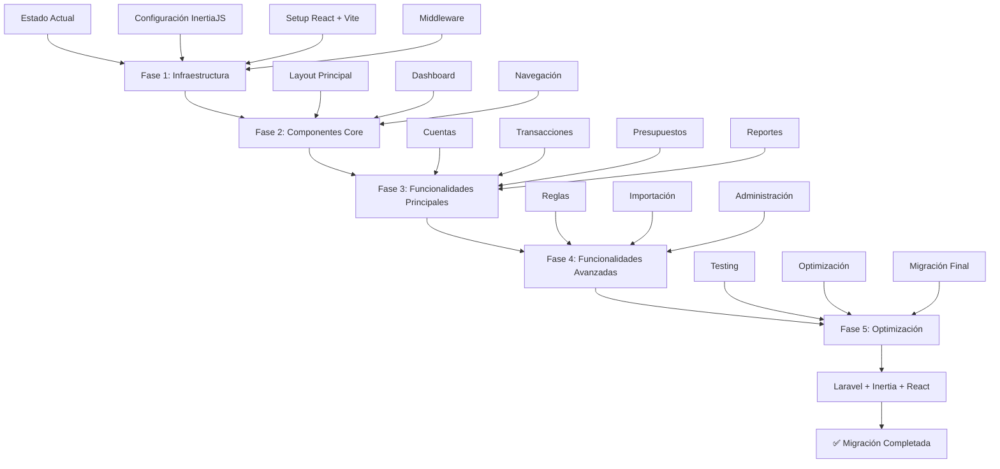

# Plan de Migración: Firefly III de Monolito a Laravel + InertiaJS 2 + React

## Resumen Ejecutivo

Este documento detalla un plan integral de migración para transformar Firefly III desde su arquitectura monolítica actual hacia una arquitectura moderna utilizando Laravel 12 como backend, InertiaJS 2 como capa de integración, y React como framework frontend. La migración se realizará de forma incremental preservando la funcionalidad existente mientras se moderniza la experiencia de usuario.

## Análisis del Estado Actual

### Arquitectura Actual
- **Backend**: Laravel 12 con PHP 8.4+
- **Frontend Dual**:
  - **v1 (Legacy)**: Laravel Mix + Vue 2 + Bootstrap 3
  - **v2 (Moderno)**: Vite + AlpineJS + Bootstrap 5
- **Base de Datos**: MySQL/PostgreSQL/SQLite
- **Autenticación**: Laravel Sanctum + Passport
- **API**: REST JSON API completa

### Estructura de Frontend Actual
```
resources/assets/
├── v1/ (Legacy - Vue 2)
│   ├── webpack.mix.js
│   ├── src/
│   │   ├── app.js (jQuery/Bootstrap)
│   │   ├── app_vue.js (Vue 2)
│   │   └── components/ (Vue 2 components)
└── v2/ (Modern - AlpineJS)
    ├── vite.config.js
    ├── src/
    │   ├── pages/ (AlpineJS pages)
    │   ├── api/ (API clients)
    │   └── store/ (State management)
```

### Controladores y Rutas
- **140+ controladores** organizados por funcionalidad
- **Sistema de rutas complejo** con middleware de autenticación
- **Dualidad de vistas** (v1/v2) en controladores como HomeController

## Objetivos de la Migración

### Objetivos Principales
1. **Unificar frontend** eliminando la dualidad v1/v2
2. **Modernizar experiencia de usuario** con React
3. **Mantener compatibilidad** con API existente
4. **Preservar funcionalidad** durante la transición
5. **Mejorar mantenibilidad** y desarrollo futuro

### Beneficios Esperados
- **Mejor rendimiento** con React y Vite
- **Desarrollo más ágil** con componentes React
- **Mejor experiencia de usuario** con interfaz moderna
- **Mantenimiento simplificado** con arquitectura unificada
- **Ecosistema React** más amplio para extensiones

## Plan de Migración Detallado

### Fase 1: Preparación e Infraestructura (Semanas 1-2)

#### 1.1 Configuración de InertiaJS 2
```bash
# Instalar dependencias de InertiaJS
composer require inertiajs/inertia-laravel
npm install @inertiajs/react react react-dom @vitejs/plugin-react
```

#### 1.2 Configuración de Vite para React
```javascript
// vite.config.js (nuevo)
import { defineConfig } from 'vite'
import laravel from 'laravel-vite-plugin'
import react from '@vitejs/plugin-react'

export default defineConfig({
  plugins: [
    laravel({
      input: ['resources/js/app.jsx'],
      refresh: true,
    }),
    react(),
  ],
})
```

#### 1.3 Middleware de Inertia
```php
// app/Http/Middleware/HandleInertiaRequests.php
class HandleInertiaRequests extends Middleware
{
    public function share(Request $request): array
    {
        return array_merge(parent::share($request), [
            'auth' => [
                'user' => $request->user(),
            ],
            'flash' => [
                'message' => fn () => $request->session()->get('message'),
            ],
        ])
    }
}
```

#### 1.4 Estructura de Directorios React
```
resources/
├── js/
│   ├── app.jsx (punto de entrada)
│   ├── Layouts/
│   │   ├── AppLayout.jsx
│   │   └── GuestLayout.jsx
│   ├── Pages/
│   │   ├── Dashboard/
│   │   ├── Accounts/
│   │   ├── Transactions/
│   │   └── ...
│   ├── Components/
│   │   ├── UI/
│   │   ├── Forms/
│   │   └── Charts/
│   └── Hooks/
└── css/
    └── app.css
```

### Fase 2: Migración de Componentes Core (Semanas 3-8)

#### 2.1 Layout Principal
```jsx
// resources/js/Layouts/AppLayout.jsx
import { Head, Link } from '@inertiajs/react'

export default function AppLayout({ children, title }) {
  return (
    <div className="app-wrapper">
      <Head title={title} />
      <Header />
      <Sidebar />
      <main className="app-main">
        <div className="app-content-header">
          <Breadcrumbs />
        </div>
        <div className="app-content">
          {children}
        </div>
      </main>
      <Footer />
    </div>
  )
}
```

#### 2.2 Dashboard
```jsx
// resources/js/Pages/Dashboard/Index.jsx
import AppLayout from '@/Layouts/AppLayout'
import { Head } from '@inertiajs/react'
import DashboardBoxes from './Components/DashboardBoxes'
import AccountChart from './Components/AccountChart'
import BudgetChart from './Components/BudgetChart'

export default function Dashboard({ accounts, budgets, categories, startDate, endDate }) {
  return (
    <AppLayout title="Dashboard">
      <Head title="Dashboard" />

      <DashboardBoxes
        accounts={accounts}
        startDate={startDate}
        endDate={endDate}
      />

      <div className="row mb-2">
        <div className="col-xl-8">
          <AccountChart accounts={accounts} />
          <BudgetChart budgets={budgets} />
          <CategoryChart categories={categories} />
        </div>
        <div className="col-xl-4">
          <AccountList accounts={accounts} />
        </div>
      </div>

      <SankeyChart
        accounts={accounts}
        startDate={startDate}
        endDate={endDate}
      />
    </AppLayout>
  )
}
```

#### 2.3 Controlador Adaptado
```php
// app/Http/Controllers/DashboardController.php
class DashboardController extends Controller
{
    public function index(): Response
    {
        $startDate = session('start', today()->startOfMonth());
        $endDate = session('end', today()->endOfMonth());

        $accounts = $this->getDashboardAccounts();
        $budgets = $this->getDashboardBudgets();
        $categories = $this->getDashboardCategories();

        return Inertia::render('Dashboard/Index', [
            'accounts' => $accounts,
            'budgets' => $budgets,
            'categories' => $categories,
            'startDate' => $startDate->format('Y-m-d'),
            'endDate' => $endDate->format('Y-m-d'),
        ]);
    }
}
```

### Fase 3: Migración de Funcionalidades Principales (Semanas 9-16)

#### 3.1 Gestión de Cuentas
- **Componentes**: AccountList, AccountForm, AccountShow
- **Funcionalidades**: CRUD, reconciliación, estados de cuenta
- **Integración**: API existente + formularios React

#### 3.2 Gestión de Transacciones
- **Componentes**: TransactionList, TransactionForm, TransactionShow
- **Funcionalidades**: Creación, edición, división, conversión
- **Desafíos**: Formularios complejos con múltiples splits

#### 3.3 Presupuestos y Categorías
- **Componentes**: BudgetList, BudgetForm, CategoryManager
- **Funcionalidades**: Límites presupuestarios, reportes

#### 3.4 Reportes y Gráficos
- **Componentes**: ChartContainer, ReportBuilder
- **Integración**: Chart.js con React
- **Migración**: AlpineJS → React hooks

### Fase 4: Funcionalidades Avanzadas (Semanas 17-24)

#### 4.1 Reglas y Automatización
- **Componentes**: RuleBuilder, RuleExecutor
- **Funcionalidades**: Triggers, actions, testing

#### 4.2 Importación y Exportación
- **Componentes**: ImportWizard, ExportManager
- **Integración**: API existente de importación

#### 4.3 Administración y Configuración
- **Componentes**: UserManagement, SystemSettings
- **Roles**: Admin vs usuario regular

### Fase 5: Optimización y Testing (Semanas 25-28)

#### 5.1 Optimización de Rendimiento
- **Lazy loading** de componentes
- **Code splitting** por rutas
- **Optimización** de bundles

#### 5.2 Testing Integral
- **Unit tests**: Componentes React
- **Integration tests**: Flujos completos
- **E2E tests**: Cypress/Playwright

#### 5.3 Migración Final
- **Deshabilitar** frontend legacy
- **Redirección** automática
- **Cleanup** de código antiguo

## Diagrama de Flujo de Migración



## Consideraciones Técnicas

### Compatibilidad con API Existente
- **Preservar** endpoints API actuales
- **Reutilizar** transformers y repositories
- **Mantener** autenticación Laravel Sanctum

### Estado y Gestión de Datos
```javascript
// Ejemplo: Hook personalizado para datos del dashboard
function useDashboardData(startDate, endDate) {
  const [data, setData] = useState(null)
  const [loading, setLoading] = useState(true)

  useEffect(() => {
    axios.get('/api/v1/dashboard', {
      params: { start_date: startDate, end_date: endDate }
    }).then(response => {
      setData(response.data)
      setLoading(false)
    })
  }, [startDate, endDate])

  return { data, loading }
}
```

### Migración de AlpineJS a React
```javascript
// AlpineJS actual (v2)
Alpine.data('accounts', () => ({
  accounts: [],
  async init() {
    this.accounts = await this.loadAccounts()
  },
  loadAccounts() {
    return axios.get('/api/v1/accounts')
  }
}))

// Equivalente React
function AccountsComponent() {
  const [accounts, setAccounts] = useState([])

  useEffect(() => {
    loadAccounts()
  }, [])

  const loadAccounts = async () => {
    const response = await axios.get('/api/v1/accounts')
    setAccounts(response.data)
  }

  return (
    <div>
      {accounts.map(account => (
        <AccountItem key={account.id} account={account} />
      ))}
    </div>
  )
}
```

### Manejo de Formularios Complejos
```jsx
// Formulario de transacción con splits
function TransactionForm({ initialData = {} }) {
  const [splits, setSplits] = useState(initialData.splits || [createEmptySplit()])

  const addSplit = () => {
    setSplits(prev => [...prev, createEmptySplit()])
  }

  const updateSplit = (index, field, value) => {
    setSplits(prev => prev.map((split, i) =>
      i === index ? { ...split, [field]: value } : split
    ))
  }

  return (
    <form onSubmit={handleSubmit}>
      {/* Campos principales */}
      <TransactionHeader />

      {/* Splits dinámicos */}
      {splits.map((split, index) => (
        <TransactionSplit
          key={split.id || index}
          split={split}
          index={index}
          onChange={updateSplit}
          onRemove={() => removeSplit(index)}
        />
      ))}

      <button type="button" onClick={addSplit}>
        Agregar Split
      </button>
    </form>
  )
}
```

## Estrategia de Implementación

### Desarrollo por Funcionalidad
1. **Módulo por módulo** en lugar de big bang
2. **Feature flags** para desarrollo progresivo
3. **Testing continuo** en cada etapa

### Preservación de Datos
- **Migración cero** de base de datos
- **Compatibilidad** total con datos existentes
- **Rollback** fácil si es necesario

### Comunicación y Documentación
- **Documentación** en tiempo real
- **Sesiones de training** para equipo
- **Feedback** continuo de usuarios beta

## Riesgos y Mitigación

### Riesgos Identificados
1. **Complejidad de formularios** de transacciones
2. **Migración de gráficos** y visualizaciones
3. **Compatibilidad** con extensiones existentes
4. **Curva de aprendizaje** del equipo

### Estrategias de Mitigación
- **Prototipado temprano** de componentes complejos
- **Testing exhaustivo** de flujos críticos
- **Comunicación proactiva** con comunidad
- **Formación gradual** del equipo

## Métricas de Éxito

### Métricas Técnicas
- **Tiempo de carga** reducido en 30%
- **Bundle size** optimizado
- **Coverage de tests** > 80%
- **Zero regressions** en funcionalidad

### Métricas de Usuario
- **Satisfacción** mejorada
- **Feedback positivo** en nueva UI
- **Adopción rápida** sin resistencia
- **Productividad** mejorada

## Conclusión

La migración de Firefly III a Laravel + InertiaJS 2 + React representa una modernización estratégica que posicionará la aplicación para el futuro. El enfoque incremental y la preservación de la API existente garantizan una transición suave mientras se entrega una experiencia de usuario moderna y mantenible.

**Timeline Total Estimado**: 28 semanas (7 meses)
**Equipo Recomendado**: 3-4 desarrolladores full-stack
**Riesgo General**: Medio (mitigado por enfoque incremental)

Este plan proporciona una hoja de ruta clara y realista para transformar Firefly III en una aplicación web moderna mientras se preserva su rica funcionalidad y base de usuarios existente.