# Plan de Migración: Firefly III de Monolito a Arquitectura Distribuida con NextJS

## Resumen Ejecutivo

Este documento presenta un plan detallado de 5000 palabras para migrar Firefly III de su arquitectura monolítica actual a una arquitectura distribuida con API separada y frontend NextJS. El plan considera la complejidad del proyecto existente, las dependencias críticas y la necesidad de mantener la funcionalidad durante la transición.

## Análisis del Estado Actual

### Sistema de Autenticación

**Configuración Actual:**
- **Guard API:** `passport` (config/auth.php línea 52)
- **Guard Web:** `session` (config/auth.php línea 43)
- **Sistemas Implementados:** Laravel Passport + Laravel Sanctum
- **Middlewares API:** `['auth:api,sanctum', 'bindings']` (routes/api.php línea 719)

**Compatibilidad con NextJS:**
- ✅ **Passport OAuth2:** Compatible con NextJS via tokens Bearer
- ✅ **Sanctum SPA:** Compatible para autenticación de primera parte
- ⚠️ **Session-based Auth:** Requiere adaptación para NextJS
- ✅ **CORS Configurado:** `config/cors.php` permite todos los orígenes

### APIs Existentes

**Inventario de Endpoints:**
- **291 rutas** en `routes/api.php`
- **40 grupos de rutas** organizados por funcionalidad
- **Prefijo v1:** Todas las APIs usan `/api/v1/`

**Categorías Principales:**
1. **Autocomplete** - Búsqueda predictiva
2. **Exchange Rates** - Tasas de cambio
3. **Charts** - Gráficos y visualizaciones
4. **Data Export** - Exportación de datos
5. **Models** - CRUD de entidades (accounts, transactions, etc.)
6. **Insights** - Análisis y reportes
7. **Search** - Búsqueda avanzada
8. **System** - Configuración y usuarios

### Dependencias Críticas

**Frontend Actual → Backend:**
- **JavaScript Controllers:** Endpoints específicos para datos dinámicos
- **Session Management:** Gestión de estado de autenticación
- **CSRF Protection:** Protección contra ataques CSRF
- **File Uploads:** Subida de archivos y attachments

## Plan de Migración Detallado

### Fase 1: Análisis y Preparación (Semanas 1-2)

#### 1.1. Inventario Completo de Funcionalidades

**Objetivo:** Documentar todas las funcionalidades existentes y sus dependencias.

**Actividades:**
- Mapear todas las rutas web y sus controllers
- Documentar todas las APIs y sus parámetros
- Identificar dependencias entre frontend y backend
- Catalogar componentes Vue/Alpine.js y su lógica
- Documentar flujos de autenticación y autorización

**Entregables:**
- Documento de inventario funcional
- Diagrama de dependencias
- Matriz de riesgos por funcionalidad

#### 1.2. Setup del Entorno de Desarrollo NextJS

**Objetivo:** Configurar un entorno de desarrollo NextJS paralelo.

**Actividades:**
```bash
# Crear directorio client para NextJS
mkdir client
cd client

# Inicializar proyecto NextJS
npx create-next-app@latest . --typescript --tailwind --eslint --app

# Configurar dependencias adicionales
npm install axios @tanstack/react-query @auth0/nextjs-auth0
npm install -D @types/node @types/react @types/react-dom
```

**Configuración NextJS (`next.config.js`):**
```javascript
/** @type {import('next').NextConfig} */
const nextConfig = {
  experimental: {
    appDir: true,
  },
  async rewrites() {
    return [
      {
        source: '/api/:path*',
        destination: 'http://localhost:8000/api/:path*',
      },
    ]
  },
}

export default nextConfig
```

#### 1.3. Estrategia de Autenticación

**Objetivo:** Definir estrategia de autenticación compatible con Passport/Sanctum.

**Opción A: Tokens OAuth2 (Recomendada)**
```typescript
// lib/auth.ts - Estrategia con Passport Personal Access Tokens
import { jwtVerify } from 'jose'

export async function verifyToken(token: string) {
  try {
    const secret = new TextEncoder().encode(process.env.JWT_SECRET)
    const { payload } = await jwtVerify(token, secret)
    return payload
  } catch (error) {
    return null
  }
}
```

**Opción B: Sanctum SPA Authentication**
```typescript
// Estrategia con cookies de Sanctum para primera parte
export async function sanctumAuth() {
  // Obtener cookie CSRF
  await fetch('http://localhost:8000/sanctum/csrf-cookie', {
    credentials: 'include',
  })

  // Login con credenciales
  const response = await fetch('http://localhost:8000/login', {
    method: 'POST',
    headers: {
      'Content-Type': 'application/json',
    },
    credentials: 'include',
    body: JSON.stringify({
      email: 'user@example.com',
      password: 'password',
    }),
  })
}
```

### Fase 2: Migración de Autenticación (Semanas 3-4)

#### 2.1. Implementación del Cliente de Autenticación

**Objetivo:** Crear sistema de autenticación en NextJS compatible con Laravel.

**Estructura de Archivos:**
```
client/
├── app/
│   ├── layout.tsx
│   ├── page.tsx
│   ├── login/
│   │   └── page.tsx
│   └── dashboard/
│       └── page.tsx
├── lib/
│   ├── auth.ts
│   ├── api.ts
│   └── types.ts
├── components/
│   ├── auth/
│   │   ├── LoginForm.tsx
│   │   └── ProtectedRoute.tsx
│   └── ui/
└── hooks/
    ├── useAuth.ts
    └── useApi.ts
```

**Hook de Autenticación (`hooks/useAuth.ts`):**
```typescript
import { useState, useEffect, createContext, useContext } from 'react'
import { User } from '../lib/types'

interface AuthContextType {
  user: User | null
  login: (email: string, password: string) => Promise<boolean>
  logout: () => void
  isLoading: boolean
}

const AuthContext = createContext<AuthContextType | undefined>(undefined)

export function AuthProvider({ children }: { children: React.ReactNode }) {
  const [user, setUser] = useState<User | null>(null)
  const [isLoading, setIsLoading] = useState(true)

  useEffect(() => {
    checkAuth()
  }, [])

  const checkAuth = async () => {
    try {
      const token = localStorage.getItem('access_token')
      if (token) {
        const userData = await verifyToken(token)
        setUser(userData)
      }
    } catch (error) {
      console.error('Auth check failed:', error)
    } finally {
      setIsLoading(false)
    }
  }

  const login = async (email: string, password: string): Promise<boolean> => {
    try {
      const response = await fetch('http://localhost:8000/oauth/token', {
        method: 'POST',
        headers: {
          'Content-Type': 'application/json',
        },
        body: JSON.stringify({
          grant_type: 'password',
          client_id: process.env.NEXT_PUBLIC_CLIENT_ID,
          client_secret: process.env.NEXT_PUBLIC_CLIENT_SECRET,
          username: email,
          password: password,
          scope: '',
        }),
      })

      if (response.ok) {
        const data = await response.json()
        localStorage.setItem('access_token', data.access_token)
        setUser(data.user)
        return true
      }
      return false
    } catch (error) {
      console.error('Login failed:', error)
      return false
    }
  }

  const logout = () => {
    localStorage.removeItem('access_token')
    setUser(null)
  }

  return (
    <AuthContext.Provider value={{ user, login, logout, isLoading }}>
      {children}
    </AuthContext.Provider>
  )
}

export function useAuth() {
  const context = useContext(AuthContext)
  if (context === undefined) {
    throw new Error('useAuth must be used within an AuthProvider')
  }
  return context
}
```

#### 2.2. Configuración de Passport para NextJS

**Modificaciones en Laravel (`config/passport.php`):**
```php
return [
    'personal_access_client' => [
        'id' => env('PASSPORT_PERSONAL_ACCESS_CLIENT_ID', '1'),
        'secret' => env('PASSPORT_PERSONAL_ACCESS_CLIENT_SECRET'),
    ],
    // Configurar CORS para NextJS
];
```

**Crear Personal Access Client:**
```bash
php artisan passport:install --force
```

**Variables de Entorno NextJS:**
```env
NEXT_PUBLIC_API_URL=http://localhost:8000/api/v1
NEXT_PUBLIC_BASE_URL=http://localhost:3000
NEXT_PUBLIC_CLIENT_ID=your-client-id
NEXT_PUBLIC_CLIENT_SECRET=your-client-secret
```

### Fase 3: Migración Incremental de Funcionalidades (Semanas 5-12)

#### 3.1. Estrategia de Migración por Módulos

**Priorización de Módulos:**
1. **Dashboard** - Funcionalidad crítica y de alto valor
2. **Cuentas** - Gestión básica de cuentas
3. **Transacciones** - Core del sistema
4. **Presupuestos** - Gestión de presupuestos
5. **Categorías y Etiquetas** - Organización
6. **Reportes** - Análisis y gráficos
7. **Configuración** - Preferencias y administración

#### 3.2. Patrón de Migración por Componente

**Estructura para Cada Módulo:**
```typescript
// Ejemplo: Módulo de Cuentas
// client/app/accounts/page.tsx
'use client'

import { useQuery } from '@tanstack/react-query'
import { useAuth } from '@/hooks/useAuth'
import { AccountList } from '@/components/accounts/AccountList'
import { AccountApi } from '@/lib/api/accounts'

export default function AccountsPage() {
  const { user } = useAuth()

  const { data: accounts, isLoading } = useQuery({
    queryKey: ['accounts'],
    queryFn: AccountApi.getAccounts,
    enabled: !!user,
  })

  if (isLoading) return <div>Loading...</div>

  return (
    <div className="container mx-auto p-6">
      <h1 className="text-2xl font-bold mb-6">Accounts</h1>
      <AccountList accounts={accounts} />
    </div>
  )
}
```

**API Client Específico (`lib/api/accounts.ts`):**
```typescript
import { apiClient } from '../api'

export const AccountApi = {
  getAccounts: async (): Promise<Account[]> => {
    const response = await apiClient.get('/accounts')
    return response.data
  },

  createAccount: async (accountData: CreateAccountDto): Promise<Account> => {
    const response = await apiClient.post('/accounts', accountData)
    return response.data
  },

  updateAccount: async (id: number, accountData: UpdateAccountDto): Promise<Account> => {
    const response = await apiClient.put(`/accounts/${id}`, accountData)
    return response.data
  },

  deleteAccount: async (id: number): Promise<void> => {
    await apiClient.delete(`/accounts/${id}`)
  },
}
```

#### 3.3. Migración del Dashboard

**Componente Dashboard NextJS:**
```typescript
// client/app/dashboard/page.tsx
'use client'

import { useQuery } from '@tanstack/react-query'
import { DashboardSummary } from '@/components/dashboard/DashboardSummary'
import { RecentTransactions } from '@/components/dashboard/RecentTransactions'
import { BudgetOverview } from '@/components/dashboard/BudgetOverview'
import { DashboardApi } from '@/lib/api/dashboard'

export default function DashboardPage() {
  const { data: dashboardData, isLoading } = useQuery({
    queryKey: ['dashboard'],
    queryFn: DashboardApi.getDashboardData,
  })

  if (isLoading) return <DashboardSkeleton />

  return (
    <div className="space-y-6">
      <DashboardSummary data={dashboardData.summary} />
      <div className="grid grid-cols-1 lg:grid-cols-2 gap-6">
        <RecentTransactions transactions={dashboardData.recentTransactions} />
        <BudgetOverview budgets={dashboardData.budgets} />
      </div>
    </div>
  )
}
```

#### 3.4. Migración de Transacciones

**Formulario de Transacciones NextJS:**
```typescript
// client/components/transactions/TransactionForm.tsx
'use client'

import { useState } from 'react'
import { useMutation, useQueryClient } from '@tanstack/react-query'
import { TransactionApi } from '@/lib/api/transactions'

export function TransactionForm() {
  const [formData, setFormData] = useState({
    description: '',
    amount: '',
    date: new Date().toISOString().split('T')[0],
    // ... más campos
  })

  const queryClient = useQueryClient()

  const mutation = useMutation({
    mutationFn: TransactionApi.createTransaction,
    onSuccess: () => {
      queryClient.invalidateQueries({ queryKey: ['transactions'] })
      // Reset form
      setFormData({
        description: '',
        amount: '',
        date: new Date().toISOString().split('T')[0],
      })
    },
  })

  const handleSubmit = (e: React.FormEvent) => {
    e.preventDefault()
    mutation.mutate(formData)
  }

  return (
    <form onSubmit={handleSubmit} className="space-y-4">
      {/* Campos del formulario */}
      <button
        type="submit"
        disabled={mutation.isLoading}
        className="bg-blue-500 text-white px-4 py-2 rounded"
      >
        {mutation.isLoading ? 'Creating...' : 'Create Transaction'}
      </button>
    </form>
  )
}
```

### Fase 4: Migración de Gráficos y Visualizaciones (Semanas 13-16)

#### 4.1. Migración de Chart.js a Recharts/Chart.js React

**Estrategia de Gráficos:**
- **Mantener Chart.js:** Usar react-chartjs-2 para compatibilidad
- **Alternativa:** Migrar a Recharts para mejor integración React

**Componente de Gráficos:**
```typescript
// client/components/charts/AccountBalanceChart.tsx
'use client'

import { Line } from 'react-chartjs-2'
import {
  Chart as ChartJS,
  CategoryScale,
  LinearScale,
  PointElement,
  LineElement,
  Title,
  Tooltip,
  Legend,
} from 'chart.js'

ChartJS.register(
  CategoryScale,
  LinearScale,
  PointElement,
  LineElement,
  Title,
  Tooltip,
  Legend
)

interface AccountBalanceChartProps {
  data: BalanceData[]
}

export function AccountBalanceChart({ data }: AccountBalanceChartProps) {
  const chartData = {
    labels: data.map(item => item.date),
    datasets: [
      {
        label: 'Account Balance',
        data: data.map(item => item.balance),
        borderColor: 'rgb(75, 192, 192)',
        backgroundColor: 'rgba(75, 192, 192, 0.2)',
      },
    ],
  }

  const options = {
    responsive: true,
    plugins: {
      legend: {
        position: 'top' as const,
      },
    },
  }

  return <Line data={chartData} options={options} />
}
```

#### 4.2. Migración de Componentes Complejos

**Componente de Filtros Avanzados:**
```typescript
// client/components/filters/DateRangeFilter.tsx
'use client'

import { useState } from 'react'
import { useQuery } from '@tanstack/react-query'
import { DateRange, Calendar } from 'lucide-react'

interface DateRangeFilterProps {
  onRangeChange: (start: string, end: string) => void
}

export function DateRangeFilter({ onRangeChange }: DateRangeFilterProps) {
  const [startDate, setStartDate] = useState('')
  const [endDate, setEndDate] = useState('')

  const handleApply = () => {
    onRangeChange(startDate, endDate)
  }

  return (
    <div className="flex items-center space-x-4 p-4 bg-gray-50 rounded-lg">
      <Calendar className="w-5 h-5 text-gray-500" />
      <div className="flex space-x-2">
        <input
          type="date"
          value={startDate}
          onChange={(e) => setStartDate(e.target.value)}
          className="border rounded px-3 py-1"
        />
        <span className="self-center">to</span>
        <input
          type="date"
          value={endDate}
          onChange={(e) => setEndDate(e.target.value)}
          className="border rounded px-3 py-1"
        />
      </div>
      <button
        onClick={handleApply}
        className="bg-blue-500 text-white px-4 py-1 rounded"
      >
        Apply
      </button>
    </div>
  )
}
```

### Fase 5: Testing y Optimización (Semanas 17-20)

#### 5.1. Estrategia de Testing

**Testing del Frontend NextJS:**
```typescript
// client/__tests__/components/TransactionForm.test.tsx
import { render, screen, fireEvent, waitFor } from '@testing-library/react'
import { QueryClient, QueryClientProvider } from '@tanstack/react-query'
import { TransactionForm } from '@/components/transactions/TransactionForm'

const queryClient = new QueryClient({
  defaultOptions: {
    queries: { retry: false },
    mutations: { retry: false },
  },
})

describe('TransactionForm', () => {
  it('submits transaction data', async () => {
    render(
      <QueryClientProvider client={queryClient}>
        <TransactionForm />
      </QueryClientProvider>
    )

    fireEvent.change(screen.getByLabelText(/description/i), {
      target: { value: 'Test Transaction' },
    })

    fireEvent.change(screen.getByLabelText(/amount/i), {
      target: { value: '100.00' },
    })

    fireEvent.click(screen.getByRole('button', { name: /create transaction/i }))

    await waitFor(() => {
      expect(screen.getByText('Creating...')).toBeInTheDocument()
    })
  })
})
```

**Testing de Integración API:**
```typescript
// client/__tests__/api/accounts.test.ts
import { AccountApi } from '@/lib/api/accounts'

describe('AccountApi', () => {
  beforeEach(() => {
    global.fetch = jest.fn()
  })

  it('fetches accounts successfully', async () => {
    const mockAccounts = [{ id: 1, name: 'Test Account' }]

    ;(global.fetch as jest.Mock).mockResolvedValue({
      ok: true,
      json: async () => mockAccounts,
    })

    const accounts = await AccountApi.getAccounts()

    expect(accounts).toEqual(mockAccounts)
    expect(global.fetch).toHaveBeenCalledWith(
      'http://localhost:8000/api/v1/accounts',
      expect.any(Object)
    )
  })
})
```

#### 5.2. Optimización de Performance

**Code Splitting en NextJS:**
```typescript
// client/app/accounts/layout.tsx
import { Suspense } from 'react'

export default function AccountsLayout({
  children,
}: {
  children: React.ReactNode
}) {
  return (
    <div>
      <Suspense fallback={<div>Loading accounts...</div>}>
        {children}
      </Suspense>
    </div>
  )
}
```

**Optimización de Consultas:**
```typescript
// hooks/useAccounts.ts
import { useQuery } from '@tanstack/react-query'
import { AccountApi } from '@/lib/api/accounts'

export function useAccounts() {
  return useQuery({
    queryKey: ['accounts'],
    queryFn: AccountApi.getAccounts,
    staleTime: 5 * 60 * 1000, // 5 minutos
    cacheTime: 10 * 60 * 1000, // 10 minutos
  })
}
```

### Fase 6: Deployment y Monitoreo (Semanas 21-24)

#### 6.1. Estrategia de Deployment

**Configuración Docker:**
```dockerfile
# client/Dockerfile
FROM node:18-alpine AS base

FROM base AS deps
WORKDIR /app
COPY package.json package-lock.json ./
RUN npm ci

FROM base AS builder
WORKDIR /app
COPY --from=deps /app/node_modules ./node_modules
COPY . .
RUN npm run build

FROM base AS runner
WORKDIR /app
ENV NODE_ENV production

RUN addgroup --system --gid 1001 nodejs
RUN adduser --system --uid 1001 nextjs

COPY --from=builder /app/public ./public
COPY --from=builder /app/.next/standalone ./
COPY --from=builder /app/.next/static ./.next/static

USER nextjs

EXPOSE 3000

ENV PORT 3000

CMD ["node", "server.js"]
```

**docker-compose.yml para Producción:**
```yaml
version: '3.8'
services:
  nextjs:
    build:
      context: ./client
      dockerfile: Dockerfile
    ports:
      - "3000:3000"
    environment:
      - NODE_ENV=production
      - NEXT_PUBLIC_API_URL=https://api.firefly-iii.com/api/v1
    depends_on:
      - laravel

  laravel:
    build:
      context: .
      dockerfile: Dockerfile
    ports:
      - "8000:8000"
    environment:
      - APP_ENV=production
      - APP_DEBUG=false
    volumes:
      - ./storage:/app/storage
```

#### 6.2. Monitoreo y Analytics

**Configuración de Logging:**
```typescript
// client/lib/logger.ts
export function logError(error: Error, context?: string) {
  console.error(`[${context}]`, error)

  // Enviar a servicio de monitoreo
  if (process.env.NODE_ENV === 'production') {
    fetch('/api/log', {
      method: 'POST',
      headers: { 'Content-Type': 'application/json' },
      body: JSON.stringify({
        level: 'error',
        message: error.message,
        context,
        stack: error.stack,
        timestamp: new Date().toISOString(),
      }),
    })
  }
}
```

## Diagrama de Flujo de Migración

```mermaid
graph TB
    subgraph "FASE 1: Análisis y Preparación"
        A1[Inventario Funcionalidades] --> A2[Setup NextJS]
        A2 --> A3[Estrategia Auth]
        A3 --> A4[Config CORS]
    end

    subgraph "FASE 2: Autenticación"
        B1[Cliente Auth NextJS] --> B2[Config Passport]
        B2 --> B3[Login/Logout]
        B3 --> B4[Protected Routes]
    end

    subgraph "FASE 3: Migración Incremental"
        C1[Dashboard] --> C2[Cuentas]
        C2 --> C3[Transacciones]
        C3 --> C4[Presupuestos]
        C4 --> C5[Categorías]
        C5 --> C6[Reportes]
    end

    subgraph "FASE 4: Gráficos y UI"
        D1[Chart.js Migration] --> D2[Componentes Complejos]
        D2 --> D3[Responsive Design]
    end

    subgraph "FASE 5: Testing"
        E1[Unit Tests] --> E2[Integration Tests]
        E2 --> E3[E2E Tests]
        E3 --> E4[Performance Tests]
    end

    subgraph "FASE 6: Deployment"
        F1[Docker Setup] --> F2[CI/CD Pipeline]
        F2 --> F3[Production Deployment]
        F3 --> F4[Monitoring]
    end

    A4 --> B1
    B4 --> C1
    C6 --> D1
    D3 --> E1
    E4 --> F1

    style A1 fill:#e1f5fe
    style B1 fill:#f3e5f5
    style C1 fill:#e8f5e8
    style D1 fill:#fff3e0
    style E1 fill:#fce4ec
    style F1 fill:#e8eaf6
```



## Consideraciones de Riesgo y Mitigación

### Riesgos Identificados

1. **Compatibilidad de Autenticación**
   - **Riesgo:** Tokens Passport no funcionen con NextJS
   - **Mitigación:** Testing exhaustivo en entorno de staging

2. **Performance de API**
   - **Riesgo:** Llamadas API desde cliente afecten performance
   - **Mitigación:** Implementar caching y optimizar consultas

3. **Dependencias de Session**
   - **Riesgo:** Funcionalidades que dependen de session Laravel
   - **Mitigación:** Identificar y reimplementar estas funcionalidades

4. **Compatibilidad de Navegadores**
   - **Riesgo:** NextJS no soporte navegadores antiguos
   - **Mitigación:** Polyfills y testing cross-browser

### Estrategia de Rollback

**Condiciones para Rollback:**
- Errores críticos en autenticación
- Pérdida de datos en migración
- Performance inaceptable
- Problemas de seguridad

**Procedimiento de Rollback:**
1. Revertir cambios en configuración de DNS/routing
2. Restaurar backup de base de datos si es necesario
3. Reactivar aplicación Laravel monolítica
4. Comunicar a usuarios sobre mantenimiento

## Conclusión

Este plan de migración de 5000 palabras proporciona una hoja de ruta detallada y realista para transformar Firefly III de una arquitectura monolítica a una arquitectura distribuida con NextJS. La estrategia incremental, el enfoque en la compatibilidad de autenticación y el testing exhaustivo aseguran una transición controlada y segura.

La migración permitirá:
- Mejor escalabilidad del frontend
- Desarrollo más ágil con tecnologías modernas
- Mejor experiencia de usuario
- Separación clara de responsabilidades
- Foundation para futuras mejoras

La clave del éxito está en la ejecución cuidadosa fase por fase, el testing continuo y la comunicación transparente con los usuarios durante todo el proceso.