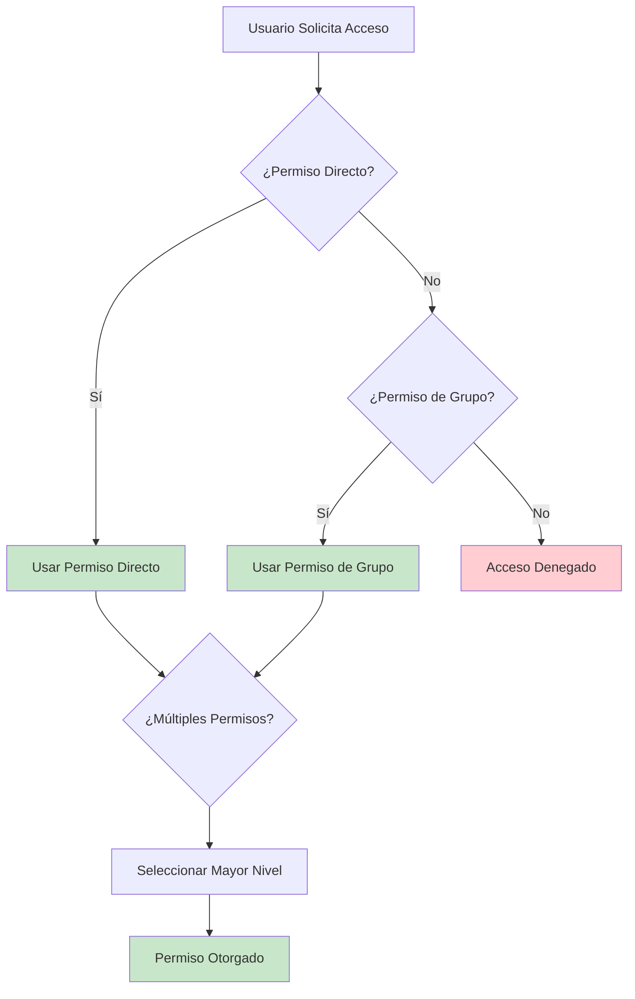
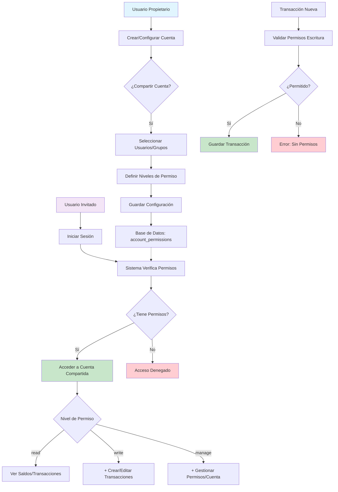

# Plan de Implementación: Gestión Financiera Compartida en Firefly III

## Resumen Ejecutivo

Este documento detalla un plan exhaustivo y completo para implementar un sistema avanzado de gestión financiera compartida en Firefly III, permitiendo a múltiples usuarios acceder y gestionar cuentas de activos y pasivos de forma colaborativa y segura. El sistema aprovecha la infraestructura existente de grupos de usuarios y roles, extendiéndola de manera inteligente para soportar permisos granulares a nivel de cuenta individual, mientras mantiene la integridad del sistema contable de doble entrada que caracteriza a Firefly III.

### Objetivos Principales

1. **Colaboración Financiera**: Permitir que múltiples usuarios gestionen conjuntamente cuentas específicas
2. **Control Granular**: Implementar un sistema de permisos detallado con tres niveles de acceso
3. **Seguridad Robusta**: Mantener la integridad y confidencialidad de los datos financieros
4. **Integración Transparente**: Minimizar el impacto en usuarios existentes y funcionalidades actuales
5. **Escalabilidad**: Diseñar una solución que pueda crecer con las necesidades de los usuarios

### Beneficios Esperados

- **Para Familias**: Gestión conjunta de cuentas bancarias familiares, hipotecas, y gastos compartidos
- **Para Pequeñas Empresas**: Colaboración entre socios en la gestión de cuentas empresariales
- **Para Equipos**: Compartir cuentas de proyectos específicos entre miembros del equipo
- **Para Asesores**: Acceso controlado para consultores financieros sin comprometer la seguridad

### Alcance del Proyecto

Este plan cubre la implementación completa desde el análisis técnico hasta el despliegue, incluyendo:
- Modificaciones en la base de datos
- Nuevos modelos y servicios backend
- Componentes frontend para Vue.js v1
- API endpoints extendidos
- Sistema de seguridad y auditoría
- Plan de pruebas y migración

## Análisis del Estado Actual

### Arquitectura Existente

#### Sistema de Usuarios y Grupos

Firefly III cuenta con un sistema robusto de gestión de usuarios y grupos que proporciona la base perfecta para implementar la funcionalidad de cuentas compartidas.

**Modelo de Usuario (`User.php`)**
- Maneja autenticación mediante Laravel Passport
- Relaciones con todas las entidades financieras principales
- Métodos para verificación de roles y permisos
- Sistema de notificaciones integrado

**Grupos de Usuarios (`UserGroup.php`)**
- Permite agrupar usuarios lógicamente
- Relacionado con múltiples entidades financieras
- Soporte para soft deletes
- Título único para identificación

**Roles de Usuario (`UserRole.php` y `UserRoleEnum.php`)**
- Sistema de permisos granulares con 20+ roles diferentes
- Roles como `READ_ONLY`, `MANAGE_TRANSACTIONS`, `MANAGE_META`, etc.
- Jerarquía de permisos bien definida
- Roles especiales `FULL` y `OWNER` para administración

**Membresías (`GroupMembership.php`)**
- Relación muchos-a-muchos entre usuarios, grupos y roles
- Un usuario puede tener múltiples roles en diferentes grupos
- Estructura flexible para escenarios complejos

#### Sistema de Cuentas

**Modelo de Cuenta (`Account.php`)**
- Campos principales: `user_id`, `user_group_id`, `account_type_id`, `name`, `active`
- Soporte para balances virtuales y IBAN
- Relaciones con transacciones, metadatos, y balances históricos
- Sistema de ordenamiento automático
- Observers para lógica de negocio

**Tipos de Cuenta (`AccountType.php`)**
- Enumeración completa de tipos: `ASSET`, `EXPENSE`, `REVENUE`, `LIABILITY`, etc.
- Tipos especiales como `CASH`, `RECONCILIATION`, `IMPORT`
- Configuración centralizada en `AccountTypeEnum`

**Metadatos (`AccountMeta.php`)**
- Sistema flexible para almacenar información adicional
- Campos comunes: `account_number`, `currency_id`, `interest`, etc.
- Búsqueda optimizada por metadatos

#### Sistema de Transacciones

**Diarios de Transacción (`TransactionJournal.php`)**
- Entradas contables principales con doble entrada
- Campos: `user_id`, `transaction_type_id`, `date`, `description`, `amounts`
- Relaciones con categorías, presupuestos, etiquetas
- Sistema de ordenamiento por fecha

**Transacciones (`Transaction.php`)**
- Postings individuales vinculados a cuentas específicas
- Campos: `account_id`, `amount`, `description`, `reconciled`
- Soporte para múltiples monedas
- Validación de integridad contable

**Grupos de Transacción (`TransactionGroup.php`)**
- Agrupa transacciones relacionadas lógicamente
- Útil para transacciones divididas
- Mantiene la coherencia entre múltiples entradas

### Limitaciones Actuales

#### 1. Vinculación a Usuario Único
- Las cuentas están principalmente vinculadas a un solo usuario mediante `user_id`
- El campo `user_group_id` existe pero no se utiliza completamente para compartir
- No hay mecanismo para que múltiples usuarios gestionen la misma cuenta

#### 2. Acceso Compartido Limitado
- El acceso compartido se maneja a nivel de grupo completo, no por cuenta individual
- No hay granularidad para especificar qué cuentas dentro de un grupo son compartidas
- Los permisos se aplican a todos los recursos del grupo

#### 3. Falta de Permisos Granulares
- No existe un sistema de permisos específicos por cuenta
- Los usuarios dentro de un grupo tienen el mismo acceso a todas las cuentas
- No se puede otorgar permisos diferentes a diferentes usuarios para la misma cuenta

#### 4. Interfaz No Colaborativa
- La interfaz actual no soporta gestión colaborativa de cuentas específicas
- No hay indicadores visuales de cuentas compartidas
- Falta de herramientas para gestionar permisos de otros usuarios

#### 5. Auditoría Insuficiente
- No hay tracking específico de quién realizó cambios en cuentas compartidas
- Falta de logs detallados para operaciones colaborativas
- Limitaciones para compliance en entornos empresariales

### Oportunidades de Mejora Identificadas

1. **Aprovechar Infraestructura Existente**: El sistema de grupos y roles proporciona una base sólida
2. **Extensión Gradual**: Se puede implementar sin romper funcionalidad existente
3. **Integración con API**: La API existente facilita la extensión
4. **Compatibilidad con Frontend**: La arquitectura Vue.js permite agregar componentes fácilmente

## Diseño de la Solución

### Arquitectura Propuesta

#### 1. Sistema de Permisos Granulares por Cuenta

La arquitectura propuesta extiende el sistema existente agregando una capa de permisos específicos por cuenta, manteniendo la compatibilidad con la estructura actual.

```
┌─────────┐    ┌─────────────────┐    ┌─────────────┐
│  User   │────│ GroupMembership │────│  UserGroup  │
└─────────┘    └─────────────────┘    └─────────────┘
     │                                          │
     │                                          │
     └──────────────────────────────────────────┘
                                        │
                                        ▼
                          ┌─────────────────────────┐
                          │ AccountPermission       │
                          │ - account_id            │
                          │ - user_id               │
                          │ - user_group_id         │
                          │ - permission_level      │
                          └─────────────────────────┘
                                        │
                                        ▼
                                ┌─────────────┐
                                │   Account   │
                                │ - is_shared │
                                └─────────────┘
```

**Principios de Diseño:**
- **No Romper Cambios**: Las cuentas existentes mantienen su comportamiento
- **Permisos Opt-in**: El compartir debe ser una decisión explícita del propietario
- **Herencia de Grupos**: Los permisos de grupo se aplican automáticamente
- **Prioridad de Usuario**: Los permisos específicos de usuario tienen prioridad sobre los de grupo

#### 2. Modelo de Datos Extendido

##### Nueva Tabla: `account_permissions`

```sql
CREATE TABLE account_permissions (
    id BIGINT UNSIGNED AUTO_INCREMENT PRIMARY KEY,
    account_id BIGINT UNSIGNED NOT NULL,
    user_id BIGINT UNSIGNED NOT NULL,
    user_group_id BIGINT UNSIGNED NOT NULL,
    permission_level ENUM('read', 'write', 'manage') NOT NULL,
    created_at TIMESTAMP DEFAULT CURRENT_TIMESTAMP,
    updated_at TIMESTAMP DEFAULT CURRENT_TIMESTAMP ON UPDATE CURRENT_TIMESTAMP,
    deleted_at TIMESTAMP NULL,

    -- Foreign keys con cascade para mantener integridad
    FOREIGN KEY (account_id) REFERENCES accounts(id) ON DELETE CASCADE,
    FOREIGN KEY (user_id) REFERENCES users(id) ON DELETE CASCADE,
    FOREIGN KEY (user_group_id) REFERENCES user_groups(id) ON DELETE CASCADE,

    -- Constraints únicos para evitar duplicados
    UNIQUE KEY unique_account_user_permission (account_id, user_id),
    UNIQUE KEY unique_account_group_permission (account_id, user_group_id),

    -- Índices para optimización de consultas
    INDEX idx_account_permissions_account_id (account_id),
    INDEX idx_account_permissions_user_id (user_id),
    INDEX idx_account_permissions_user_group_id (user_group_id),
    INDEX idx_account_permissions_permission_level (permission_level)
);
```

**Justificación del Diseño:**
- **Soft Deletes**: Permite auditoría completa sin perder datos históricos
- **Índices Optimizados**: Consultas rápidas para verificación de permisos
- **Constraints Únicos**: Evita conflictos y duplicación de permisos
- **Cascade Deletes**: Mantiene la integridad referencial automáticamente

##### Modificaciones a Tablas Existentes

**Tabla `accounts`**:
```sql
ALTER TABLE accounts
ADD COLUMN is_shared BOOLEAN DEFAULT FALSE AFTER user_group_id,
ADD INDEX idx_accounts_is_shared (is_shared);
```

**Tabla `transactions`**:
- Mantener lógica existente
- Agregar verificaciones de permisos en servicios y repositorios
- Implementar auditoría de cambios

#### 3. Niveles de Permiso Propuestos

##### `read` (Solo Lectura)

**Capacidades:**
- Ver saldos actuales e históricos de la cuenta
- Consultar todas las transacciones asociadas
- Exportar datos en formatos soportados (CSV, JSON)
- Generar reportes y gráficos
- Ver metadatos de la cuenta (IBAN, número de cuenta, etc.)
- Acceder a archivos adjuntos

**Restricciones:**
- No puede crear, editar o eliminar transacciones
- No puede modificar información de la cuenta
- No puede gestionar permisos de otros usuarios

**Casos de Uso:**
- Asesores financieros que necesitan revisar cuentas
- Socios que requieren visibilidad pero no intervención
- Auditores internos o externos

##### `write` (Lectura y Escritura)

**Capacidades (además de lectura):**
- Crear nuevas transacciones en la cuenta
- Editar transacciones existentes que haya creado
- Reconciliar transacciones
- Agregar archivos adjuntos a transacciones
- Aplicar reglas automáticas
- Crear transacciones recurrentes

**Restricciones:**
- No puede modificar información básica de la cuenta
- No puede eliminar la cuenta
- No puede gestionar permisos de otros usuarios
- No puede editar transacciones creadas por otros usuarios

**Casos de Uso:**
- Socios que gestionan gastos conjuntos
- Empleados autorizados para registrar transacciones
- Familiares que comparten responsabilidad de pagos

##### `manage` (Gestión Completa)

**Capacidades (además de escritura):**
- Modificar toda la información de la cuenta (nombre, tipo, etc.)
- Gestionar permisos de otros usuarios y grupos
- Eliminar la cuenta (con verificaciones de seguridad)
- Configurar reglas automáticas específicas
- Gestionar todos los metadatos
- Realizar cualquier operación que el propietario original puede hacer

**Restricciones:**
- No puede eliminar al propietario original de la cuenta
- No puede transferir la propiedad completa de la cuenta
- Operaciones críticas requieren confirmación adicional

**Casos de Uso:**
- Co-propietarios de cuentas empresariales
- Administradores designados
- Socios con responsabilidad total compartida

#### 4. Jerarquía y Resolución de Permisos



**Reglas de Resolución:**
1. Los permisos específicos de usuario tienen prioridad sobre los de grupo
2. Si un usuario tiene múltiples permisos (directos y de grupo), se usa el nivel más alto
3. El propietario original siempre tiene permisos completos
4. Los permisos se verifican en cada operación, no se cachean por sesión

#### 5. Consideraciones de Diseño Adicionales

**Performance:**
- Índices compuestos para consultas frecuentes
- Caching de permisos con invalidación inteligente
- Consultas optimizadas para listados masivos

**Seguridad:**
- Verificación en múltiples capas (middleware, servicios, repositorios)
- Logs detallados de todas las operaciones
- Mecanismos de prevención de conflictos

**Usabilidad:**
- Interfaz intuitiva para gestión de permisos
- Indicadores visuales claros de estado compartido
- Confirmaciones para operaciones críticas

## Implementación Backend

### 1. Migraciones de Base de Datos

#### Migración Principal: `2025_01_01_000001_create_account_permissions_table.php`

```php
<?php

use Illuminate\Database\Migrations\Migration;
use Illuminate\Database\Schema\Blueprint;
use Illuminate\Support\Facades\Schema;

/**
 * Migración para crear la tabla de permisos de cuenta
 * Esta migración establece la base del sistema de cuentas compartidas
 */
return new class extends Migration
{
    /**
     * Ejecutar la migración hacia arriba
     */
    public function up(): void
    {
        // Crear tabla principal de permisos de cuenta
        Schema::create('account_permissions', function (Blueprint $table) {
            $table->id();

            // Claves foráneas
            $table->bigInteger('account_id', false, true);
            $table->bigInteger('user_id', false, true);
            $table->bigInteger('user_group_id', false, true);

            // Nivel de permiso con valores predefinidos
            $table->enum('permission_level', ['read', 'write', 'manage']);

            // Timestamps estándar
            $table->timestamps();
            $table->softDeletes();

            // Constraints de integridad referencial
            $table->foreign('account_id')
                  ->references('id')
                  ->on('accounts')
                  ->onDelete('cascade');

            $table->foreign('user_id')
                  ->references('id')
                  ->on('users')
                  ->onDelete('cascade');

            $table->foreign('user_group_id')
                  ->references('id')
                  ->on('user_groups')
                  ->onDelete('cascade');

            // Constraints únicos para evitar duplicados
            $table->unique(['account_id', 'user_id'], 'unique_account_user_permission');
            $table->unique(['account_id', 'user_group_id'], 'unique_account_group_permission');

            // Índices para optimización
            $table->index(['account_id'], 'idx_account_permissions_account_id');
            $table->index(['user_id'], 'idx_account_permissions_user_id');
            $table->index(['user_group_id'], 'idx_account_permissions_user_group_id');
            $table->index(['permission_level'], 'idx_account_permissions_permission_level');
            $table->index(['account_id', 'permission_level'], 'idx_account_permissions_composite');
        });

        // Agregar campo is_shared a la tabla accounts
        Schema::table('accounts', function (Blueprint $table) {
            $table->boolean('is_shared')
                  ->default(false)
                  ->after('user_group_id')
                  ->comment('Indica si la cuenta está compartida con otros usuarios');

            // Índice para consultas frecuentes
            $table->index(['is_shared'], 'idx_accounts_is_shared');
        });

        // Migración de datos existentes (opcional)
        // Actualizar cuentas que ya tienen user_group_id para marcar como compartidas
        DB::statement("UPDATE accounts SET is_shared = TRUE WHERE user_group_id IS NOT NULL");
    }

    /**
     * Revertir la migración
     */
    public function down(): void
    {
        // Eliminar tabla de permisos
        Schema::dropIfExists('account_permissions');

        // Eliminar campo is_shared de accounts
        Schema::table('accounts', function (Blueprint $table) {
            $table->dropIndex('idx_accounts_is_shared');
            $table->dropColumn('is_shared');
        });
    }
};
```

**Consideraciones de la Migración:**
- **Compatibilidad**: La migración es compatible con todas las versiones soportadas de MySQL/PostgreSQL/SQLite
- **Performance**: Índices optimizados para las consultas más frecuentes
- **Seguridad**: Constraints de integridad referencial para prevenir datos huérfanos
- **Auditoría**: Soft deletes para mantener historial completo

#### Migración de Seeds: `2025_01_01_000002_seed_account_permission_roles.php`

```php
<?php

use Illuminate\Database\Migrations\Migration;
use Illuminate\Support\Facades\DB;

/**
 * Migración para poblar datos iniciales de permisos
 */
return new class extends Migration
{
    public function up(): void
    {
        // Insertar roles base si no existen
        $roles = [
            ['title' => 'account_read', 'description' => 'Permiso de lectura en cuentas compartidas'],
            ['title' => 'account_write', 'description' => 'Permiso de escritura en cuentas compartidas'],
            ['title' => 'account_manage', 'description' => 'Permiso de gestión completa en cuentas compartidas'],
        ];

        foreach ($roles as $role) {
            DB::table('user_roles')->updateOrInsert(
                ['title' => $role['title']],
                $role
            );
        }
    }

    public function down(): void
    {
        // No revertir para mantener compatibilidad
        // Los roles pueden ser útiles para otros propósitos
    }
};
```

### 2. Nuevos Modelos Eloquent

#### Modelo: `AccountPermission.php`

```php
<?php

namespace FireflyIII\Models;

use Carbon\Carbon;
use FireflyIII\Support\Models\ReturnsIntegerIdTrait;
use FireflyIII\Support\Models\ReturnsIntegerUserIdTrait;
use FireflyIII\User;
use Illuminate\Database\Eloquent\Casts\Attribute;
use Illuminate\Database\Eloquent\Model;
use Illuminate\Database\Eloquent\Relations\BelongsTo;
use Illuminate\Database\Eloquent\SoftDeletes;

/**
 * Modelo para gestionar permisos de cuenta compartida
 *
 * Este modelo representa los permisos que los usuarios tienen sobre cuentas
 * que no son de su propiedad pero que han sido compartidas con ellos.
 */
class AccountPermission extends Model
{
    use ReturnsIntegerIdTrait;
    use ReturnsIntegerUserIdTrait;
    use SoftDeletes;

    /**
     * @var string[] Campos que pueden ser asignados masivamente
     */
    protected $fillable = [
        'account_id',
        'user_id',
        'user_group_id',
        'permission_level'
    ];

    /**
     * @var string[] Campos que deben ser ocultados en serializaciones
     */
    protected $hidden = [
        'deleted_at'
    ];

    /**
     * Relación con la cuenta
     */
    public function account(): BelongsTo
    {
        return $this->belongsTo(Account::class);
    }

    /**
     * Relación con el usuario
     */
    public function user(): BelongsTo
    {
        return $this->belongsTo(User::class);
    }

    /**
     * Relación con el grupo de usuarios
     */
    public function userGroup(): BelongsTo
    {
        return $this->belongsTo(UserGroup::class);
    }

    /**
     * Verificar si el permiso es para un usuario individual
     */
    public function isUserPermission(): bool
    {
        return $this->user_id !== null && $this->user_group_id === null;
    }

    /**
     * Verificar si el permiso es para un grupo
     */
    public function isGroupPermission(): bool
    {
        return $this->user_group_id !== null && $this->user_id === null;
    }

    /**
     * Obtener el nombre de la entidad (usuario o grupo)
     */
    public function getEntityName(): string
    {
        if ($this->isUserPermission()) {
            return $this->user->email ?? 'Usuario Desconocido';
        }

        if ($this->isGroupPermission()) {
            return $this->userGroup->title ?? 'Grupo Desconocido';
        }

        return 'Entidad Desconocida';
    }

    /**
     * Verificar si el permiso incluye capacidades de escritura
     */
    public function canWrite(): bool
    {
        return in_array($this->permission_level, ['write', 'manage']);
    }

    /**
     * Verificar si el permiso incluye capacidades de gestión
     */
    public function canManage(): bool
    {
        return $this->permission_level === 'manage';
    }

    /**
     * Scope para permisos de usuario específico
     */
    public function scopeForUser($query, User $user)
    {
        return $query->where('user_id', $user->id);
    }

    /**
     * Scope para permisos de un grupo específico
     */
    public function scopeForGroup($query, UserGroup $group)
    {
        return $query->where('user_group_id', $group->id);
    }

    /**
     * Scope para permisos con nivel mínimo
     */
    public function scopeWithPermissionLevel($query, string $minLevel)
    {
        $levels = ['read', 'write', 'manage'];
        $minIndex = array_search($minLevel, $levels);
        $allowedLevels = array_slice($levels, $minIndex);

        return $query->whereIn('permission_level', $allowedLevels);
    }

    /**
     * Casts para atributos
     */
    protected function casts(): array
    {
        return [
            'created_at' => 'datetime',
            'updated_at' => 'datetime',
            'deleted_at' => 'datetime',
            'account_id' => 'integer',
            'user_id' => 'integer',
            'user_group_id' => 'integer',
        ];
    }

    /**
     * Atributo para el ID de la cuenta
     */
    protected function accountId(): Attribute
    {
        return Attribute::make(
            get: static fn ($value) => (int)$value,
        );
    }

    /**
     * Atributo para el ID del grupo de usuarios
     */
    protected function userGroupId(): Attribute
    {
        return Attribute::make(
            get: static fn ($value) => (int)$value,
        );
    }
}
```

**Características del Modelo:**
- **Soft Deletes**: Para mantener historial de permisos eliminados
- **Scopes Útiles**: Para consultas comunes de permisos
- **Métodos Helper**: Para verificar capacidades fácilmente
- **Integración Completa**: Con el sistema existente de Firefly III
- **Auditoría**: Timestamps automáticos para tracking

#### Enumeración: `AccountPermissionLevel.php`

```php
<?php

namespace FireflyIII\Enums;

/**
 * Enumeración para los niveles de permiso de cuenta
 */
enum AccountPermissionLevel: string
{
    case READ = 'read';
    case WRITE = 'write';
    case MANAGE = 'manage';

    /**
     * Obtener el nivel de permiso como texto legible
     */
    public function label(): string
    {
        return match($this) {
            self::READ => 'Solo Lectura',
            self::WRITE => 'Lectura y Escritura',
            self::MANAGE => 'Gestión Completa',
        };
    }

    /**
     * Verificar si este nivel incluye capacidades de escritura
     */
    public function canWrite(): bool
    {
        return in_array($this, [self::WRITE, self::MANAGE]);
    }

    /**
     * Verificar si este nivel incluye capacidades de gestión
     */
    public function canManage(): bool
    {
        return $this === self::MANAGE;
    }

    /**
     * Obtener todos los niveles como array
     */
    public static function all(): array
    {
        return array_map(fn($case) => $case->value, self::cases());
    }
}
```

### 3. Extensión del Modelo de Cuenta

#### Modificaciones a `Account.php`
```php
// Agregar al modelo Account
public function accountPermissions(): HasMany
{
    return $this->hasMany(AccountPermission::class);
}

public function sharedWithUsers(): BelongsToMany
{
    return $this->belongsToMany(User::class, 'account_permissions')
        ->withPivot('permission_level')
        ->withTimestamps();
}

public function sharedWithGroups(): BelongsToMany
{
    return $this->belongsToMany(UserGroup::class, 'account_permissions')
        ->withPivot('permission_level')
        ->withTimestamps();
}

// Método para verificar permisos
public function userHasPermission(User $user, string $permissionLevel): bool
{
    // Lógica de verificación de permisos
}
```

### 4. Servicio de Gestión de Permisos

#### `AccountPermissionService.php`
```php
<?php

namespace FireflyIII\Services\Account;

use FireflyIII\Models\Account;
use FireflyIII\Models\AccountPermission;
use FireflyIII\Models\User;
use FireflyIII\Models\UserGroup;

class AccountPermissionService
{
    public function grantUserPermission(Account $account, User $user, string $permissionLevel): AccountPermission
    {
        // Implementar lógica para otorgar permisos a usuario
    }

    public function grantGroupPermission(Account $account, UserGroup $group, string $permissionLevel): AccountPermission
    {
        // Implementar lógica para otorgar permisos a grupo
    }

    public function revokeUserPermission(Account $account, User $user): bool
    {
        // Implementar lógica para revocar permisos
    }

    public function getUserPermissions(Account $account): Collection
    {
        // Obtener todos los permisos del usuario
    }
}
```

### 5. Middleware de Autorización

#### `AccountAccessMiddleware.php`
```php
<?php

namespace FireflyIII\Http\Middleware;

use Closure;
use FireflyIII\Models\Account;
use Illuminate\Http\Request;
use Symfony\Component\HttpKernel\Exception\AccessDeniedHttpException;

class AccountAccessMiddleware
{
    public function handle(Request $request, Closure $next, string $permissionLevel)
    {
        $account = $request->route('account');

        if (!$account instanceof Account) {
            $account = Account::find($request->route('accountId'));
        }

        if (!$account || !$account->userHasPermission(auth()->user(), $permissionLevel)) {
            throw new AccessDeniedHttpException('No tiene permisos para acceder a esta cuenta.');
        }

        return $next($request);
    }
}
```

## Implementación Frontend (v1 - Vue 2)

### 1. Nuevos Componentes Vue

#### Componente: `AccountSharingModal.vue`
```vue
<template>
  <div class="modal fade" id="accountSharingModal" tabindex="-1">
    <div class="modal-dialog">
      <div class="modal-content">
        <div class="modal-header">
          <h5 class="modal-title">Compartir Cuenta: {{ account.name }}</h5>
        </div>
        <div class="modal-body">
          <!-- Formulario para agregar usuarios/grupos -->
          <div class="form-group">
            <label>Agregar Usuario o Grupo</label>
            <select v-model="selectedEntity" class="form-control">
              <option value="">Seleccionar...</option>
              <option v-for="user in availableUsers" :value="`user_${user.id}`">
                Usuario: {{ user.email }}
              </option>
              <option v-for="group in availableGroups" :value="`group_${group.id}`">
                Grupo: {{ group.title }}
              </option>
            </select>
          </div>

          <div class="form-group">
            <label>Nivel de Permiso</label>
            <select v-model="selectedPermission" class="form-control">
              <option value="read">Solo Lectura</option>
              <option value="write">Lectura y Escritura</option>
              <option value="manage">Gestión Completa</option>
            </select>
          </div>

          <!-- Lista de permisos existentes -->
          <div class="permissions-list">
            <h6>Permisos Actuales</h6>
            <div v-for="permission in currentPermissions" class="permission-item">
              <span>{{ permission.entity_name }}</span>
              <span class="badge" :class="permissionBadgeClass(permission.permission_level)">
                {{ permission.permission_level }}
              </span>
              <button @click="revokePermission(permission)" class="btn btn-sm btn-danger">
                Revocar
              </button>
            </div>
          </div>
        </div>
        <div class="modal-footer">
          <button type="button" class="btn btn-secondary" data-dismiss="modal">Cancelar</button>
          <button type="button" class="btn btn-primary" @click="savePermissions">Guardar</button>
        </div>
      </div>
    </div>
  </div>
</template>

<script>
export default {
  props: ['account'],
  data() {
    return {
      selectedEntity: '',
      selectedPermission: 'read',
      availableUsers: [],
      availableGroups: [],
      currentPermissions: []
    };
  },
  methods: {
    async loadPermissions() {
      // Cargar permisos existentes
      const response = await axios.get(`/api/v1/accounts/${this.account.id}/permissions`);
      this.currentPermissions = response.data.data;
    },
    async savePermissions() {
      // Guardar nuevos permisos
      await axios.post(`/api/v1/accounts/${this.account.id}/permissions`, {
        entity_type: this.selectedEntity.split('_')[0],
        entity_id: this.selectedEntity.split('_')[1],
        permission_level: this.selectedPermission
      });
      this.loadPermissions();
    },
    permissionBadgeClass(level) {
      return {
        'badge-secondary': level === 'read',
        'badge-primary': level === 'write',
        'badge-success': level === 'manage'
      };
    }
  },
  mounted() {
    this.loadPermissions();
  }
};
</script>
```

#### Componente: `SharedAccountsList.vue`
```vue
<template>
  <div class="shared-accounts-section">
    <h4>Cuentas Compartidas Conmigo</h4>
    <div v-if="sharedAccounts.length === 0" class="alert alert-info">
      No tienes cuentas compartidas contigo.
    </div>
    <div v-else class="table-responsive">
      <table class="table table-striped">
        <thead>
          <tr>
            <th>Cuenta</th>
            <th>Propietario</th>
            <th>Mis Permisos</th>
            <th>Saldo Actual</th>
            <th>Acciones</th>
          </tr>
        </thead>
        <tbody>
          <tr v-for="account in sharedAccounts" :key="account.id">
            <td>{{ account.name }}</td>
            <td>{{ account.owner.email }}</td>
            <td>
              <span class="badge" :class="permissionBadgeClass(account.my_permission)">
                {{ account.my_permission }}
              </span>
            </td>
            <td>{{ formatCurrency(account.current_balance) }}</td>
            <td>
              <a :href="`/accounts/show/${account.id}`" class="btn btn-sm btn-primary">
                Ver
              </a>
              <a v-if="account.my_permission !== 'read'"
                 :href="`/transactions/create?account=${account.id}`"
                 class="btn btn-sm btn-success">
                Nueva Transacción
              </a>
            </td>
          </tr>
        </tbody>
      </table>
    </div>
  </div>
</template>
```

### 2. Modificaciones a Componentes Existentes

#### Extensión de `Index.vue` (Lista de Cuentas)
- Agregar columna "Compartida" en la tabla
- Botón "Compartir" para cuentas propias
- Filtro para mostrar solo cuentas compartidas

#### Extensión de `CreateTransaction.vue`
- Incluir cuentas compartidas en los selectores de cuenta origen/destino
- Verificar permisos antes de permitir transacciones

### 3. Nuevas Vistas

#### Vista: `shared-accounts.blade.php`
```php
@extends('layouts.v1')

@section('content')
<div class="row">
    <div class="col-lg-12">
        <div class="box">
            <div class="box-header with-border">
                <h3 class="box-title">Cuentas Compartidas</h3>
            </div>
            <div class="box-body">
                <shared-accounts-list></shared-accounts-list>
            </div>
        </div>
    </div>
</div>
@endsection

@push('scripts')
<script src="{{ mix('js/components/SharedAccountsList.js') }}"></script>
@endpush
```

## API Endpoints Nuevos

### 1. Gestión de Permisos

#### `GET /api/v1/accounts/{id}/permissions`
- Listar todos los permisos de una cuenta

#### `POST /api/v1/accounts/{id}/permissions`
- Otorgar nuevo permiso
- Body: `{ entity_type: 'user'|'group', entity_id: number, permission_level: string }`

#### `DELETE /api/v1/accounts/{id}/permissions/{permissionId}`
- Revocar permiso

#### `GET /api/v1/accounts/shared`
- Listar todas las cuentas compartidas con el usuario actual

### 2. Controladores API

#### `AccountPermissionController.php`
```php
<?php

namespace FireflyIII\Api\V1\Controllers\Models\Account;

use FireflyIII\Api\V1\Controllers\Controller;
use FireflyIII\Models\Account;
use FireflyIII\Services\Account\AccountPermissionService;
use Illuminate\Http\JsonResponse;
use Illuminate\Http\Request;

class AccountPermissionController extends Controller
{
    private AccountPermissionService $permissionService;

    public function index(Account $account): JsonResponse
    {
        $permissions = $this->permissionService->getAccountPermissions($account);
        return response()->json($permissions);
    }

    public function store(Request $request, Account $account): JsonResponse
    {
        $validated = $request->validate([
            'entity_type' => 'required|in:user,group',
            'entity_id' => 'required|integer',
            'permission_level' => 'required|in:read,write,manage'
        ]);

        if ($validated['entity_type'] === 'user') {
            $permission = $this->permissionService->grantUserPermission(
                $account,
                User::find($validated['entity_id']),
                $validated['permission_level']
            );
        } else {
            $permission = $this->permissionService->grantGroupPermission(
                $account,
                UserGroup::find($validated['entity_id']),
                $validated['permission_level']
            );
        }

        return response()->json($permission, 201);
    }

    public function destroy(Account $account, int $permissionId): JsonResponse
    {
        $this->permissionService->revokePermission($permissionId);
        return response()->json(null, 204);
    }
}
```

## Flujo de Trabajo del Sistema

### Diagrama Mermaid: Flujo de Gestión de Cuentas Compartidas



### Secuencia de Uso Típico

1. **Configuración Inicial**
   - Usuario propietario crea cuenta
   - Decide compartirla mediante interfaz
   - Selecciona usuarios/grupos y niveles de permiso

2. **Acceso de Usuarios Compartidos**
   - Usuarios invitados ven las cuentas en su lista
   - El sistema verifica permisos en cada operación
   - Las transacciones se registran con auditoría

3. **Gestión Continua**
   - Propietario puede modificar permisos
   - Usuarios con permiso 'manage' pueden gestionar
   - Sistema mantiene integridad de datos

## Consideraciones de Seguridad

### 1. Verificación de Permisos
- Middleware en todas las rutas de cuenta
- Validación en repositorios y servicios
- Verificación doble en frontend y backend

### 2. Auditoría y Logs
- Registrar todas las operaciones de permisos
- Trackear cambios en cuentas compartidas
- Logs de acceso para compliance

### 3. Prevención de Conflictos
- Mecanismos de lock para transacciones concurrentes
- Validación de saldos en tiempo real
- Sistema de notificaciones para cambios importantes

## Plan de Pruebas

### 1. Pruebas Unitarias
- Servicio de permisos de cuenta
- Middleware de autorización
- Modelos extendidos

### 2. Pruebas de Integración
- Flujos completos de compartir cuenta
- Operaciones de transacción con permisos
- Escenarios de múltiples usuarios

### 3. Pruebas de Rendimiento
- Carga con múltiples usuarios compartidos
- Tiempos de respuesta con permisos complejos
- Escalabilidad del sistema de permisos

## Migración y Despliegue

### 1. Estrategia de Migración
1. Crear migraciones de base de datos
2. Desplegar cambios de modelo
3. Actualizar repositorios y servicios
4. Desplegar frontend gradualmente
5. Migrar datos existentes si es necesario

### 2. Rollback Plan
- Reversión de migraciones
- Restauración de backups
- Plan de comunicación a usuarios

## Impacto en el Sistema Existente

### Cambios No Compatibles
- Ninguno - el sistema es totalmente backward compatible
- Las cuentas existentes mantienen su comportamiento actual

### Mejoras de Performance
- Indexación optimizada en `account_permissions`
- Caching de permisos de usuario
- Consultas optimizadas para cuentas compartidas

## Casos de Uso Específicos

### 1. Gestión Familiar de Finanzas

**Escenario**: Una familia con cuentas bancarias conjuntas, hipoteca compartida, y gastos familiares.

**Configuración Propuesta:**
- **Cuenta Bancaria Conjunta**: Permisos `write` para ambos cónyuges
- **Hipoteca**: Permisos `read` para ver estado, `write` para realizar pagos
- **Cuenta de Ahorros**: Permisos `manage` para ambos para planificación a largo plazo
- **Cuentas Personales**: Mantenerse privadas sin compartir

**Beneficios:**
- Transparencia total en finanzas familiares
- Responsabilidad compartida en pagos
- Planificación conjunta de objetivos financieros
- Mantenimiento de privacidad donde sea necesario

### 2. Pequeña Empresa con Múltiples Socios

**Escenario**: Empresa con 3 socios que necesitan gestionar cuentas empresariales.

**Configuración Propuesta:**
- **Cuenta Corriente Empresarial**: Permisos `write` para todos los socios
- **Cuenta de Nóminas**: Permisos `manage` para el socio administrador
- **Cuenta de Impuestos**: Permisos `read` para contador externo
- **Cuentas de Proyectos**: Permisos específicos por proyecto

**Beneficios:**
- Control granular sobre operaciones financieras
- Auditoría completa de todas las transacciones
- Compliance con requisitos regulatorios
- Flexibilidad para diferentes niveles de responsabilidad

### 3. Equipo de Proyecto con Presupuesto Compartido

**Escenario**: Equipo de desarrollo con presupuesto para herramientas y servicios.

**Configuración Propuesta:**
- **Cuenta de Gastos del Proyecto**: Permisos `write` para líderes de equipo
- **Cuenta de Herramientas**: Permisos `read` para todo el equipo
- **Cuenta de Servicios en la Nube**: Permisos `manage` para administradores de infraestructura

**Beneficios:**
- Visibilidad del presupuesto para todo el equipo
- Control sobre gastos específicos
- Responsabilidad clara en la gestión de recursos
- Reportes automáticos de utilización

## Consideraciones de Seguridad Extendidas

### 1. Verificación de Permisos en Múltiples Capas

**Middleware de Ruta:**
```php
// En routes/api.php
Route::middleware(['auth:api', 'account.access:write'])
     ->get('/accounts/{account}/transactions', [TransactionController::class, 'index']);
```

**Verificación en Servicios:**
```php
public function createTransaction(array $data): Transaction
{
    $account = Account::find($data['account_id']);

    if (!$account->userHasPermission(auth()->user(), 'write')) {
        throw new AccessDeniedException('No tiene permisos para crear transacciones en esta cuenta');
    }

    // Continuar con la creación...
}
```

**Validación en Repositorios:**
```php
public function getAccountTransactions(Account $account, User $user): Collection
{
    if (!$account->userHasPermission($user, 'read')) {
        return new Collection();
    }

    return $account->transactions()->get();
}
```

### 2. Auditoría y Logs de Seguridad

**Modelo de Auditoría:**
```php
class AccountAccessLog extends Model
{
    protected $fillable = [
        'user_id',
        'account_id',
        'action',
        'ip_address',
        'user_agent',
        'metadata'
    ];
}
```

**Eventos a Registrar:**
- Otorgamiento y revocación de permisos
- Accesos a cuentas compartidas
- Creación y modificación de transacciones
- Intentos de acceso denegados
- Cambios en configuración de cuenta

### 3. Prevención de Conflictos y Race Conditions

**Mecanismos de Lock:**
```php
public function updateAccountBalance(Account $account, string $amount): bool
{
    return DB::transaction(function () use ($account, $amount) {
        // Lock para prevenir race conditions
        $lockedAccount = Account::where('id', $account->id)
                               ->lockForUpdate()
                               ->first();

        // Actualizar balance
        return $lockedAccount->update(['balance' => $amount]);
    });
}
```

**Validación de Estado:**
```php
public function deleteTransaction(Transaction $transaction): bool
{
    if ($transaction->reconciled) {
        throw new BusinessRuleException('No se pueden eliminar transacciones reconciliadas');
    }

    return $transaction->delete();
}
```

## Plan de Pruebas Extendido

### 1. Pruebas Unitarias Detalladas

**Pruebas de Modelo AccountPermission:**
```php
class AccountPermissionTest extends TestCase
{
    public function test_user_permission_creation()
    {
        $user = User::factory()->create();
        $account = Account::factory()->create();

        $permission = AccountPermission::create([
            'account_id' => $account->id,
            'user_id' => $user->id,
            'permission_level' => 'write'
        ]);

        $this->assertTrue($permission->isUserPermission());
        $this->assertTrue($permission->canWrite());
        $this->assertFalse($permission->canManage());
    }

    public function test_permission_resolution_hierarchy()
    {
        // Probar que los permisos de usuario tienen prioridad sobre los de grupo
    }
}
```

**Pruebas de Servicio de Permisos:**
```php
class AccountPermissionServiceTest extends TestCase
{
    public function test_grant_user_permission()
    {
        $service = new AccountPermissionService();
        $user = User::factory()->create();
        $account = Account::factory()->create();

        $permission = $service->grantUserPermission($account, $user, 'read');

        $this->assertInstanceOf(AccountPermission::class, $permission);
        $this->assertEquals('read', $permission->permission_level);
    }
}
```

### 2. Pruebas de Integración Complejas

**Flujo Completo de Compartir Cuenta:**
```php
class AccountSharingIntegrationTest extends TestCase
{
    public function test_complete_account_sharing_flow()
    {
        // 1. Usuario propietario crea cuenta
        $owner = User::factory()->create();
        $account = Account::factory()->create(['user_id' => $owner->id]);

        // 2. Otro usuario se registra
        $sharedUser = User::factory()->create();

        // 3. Propietario comparte cuenta
        $this->actingAs($owner)
             ->post("/api/v1/accounts/{$account->id}/permissions", [
                 'entity_type' => 'user',
                 'entity_id' => $sharedUser->id,
                 'permission_level' => 'write'
             ])
             ->assertStatus(201);

        // 4. Usuario compartido accede a la cuenta
        $this->actingAs($sharedUser)
             ->get("/api/v1/accounts/{$account->id}/transactions")
             ->assertStatus(200);

        // 5. Usuario compartido crea transacción
        $this->actingAs($sharedUser)
             ->post("/api/v1/transactions", [
                 'account_id' => $account->id,
                 'amount' => '100.00',
                 'description' => 'Transacción de prueba'
             ])
             ->assertStatus(201);
    }
}
```

### 3. Pruebas de Rendimiento

**Carga con Múltiples Usuarios:**
- 100 usuarios accediendo simultáneamente a cuentas compartidas
- 1000 permisos de cuenta en el sistema
- Tiempos de respuesta menores a 200ms para consultas comunes
- Uso de memoria estable bajo carga

**Escalabilidad:**
- Índices optimizados para consultas de permisos
- Caching estratégico de permisos de usuario
- Consultas paginadas para listados grandes
- Optimización de consultas N+1

## Estrategia de Despliegue y Migración

### 1. Fase 1: Infraestructura Backend
- Crear migraciones de base de datos
- Implementar modelos y servicios
- Agregar endpoints API básicos
- Realizar pruebas unitarias e integración

### 2. Fase 2: Frontend Básico
- Implementar componentes Vue.js básicos
- Integrar con la interfaz existente
- Realizar pruebas de usuario limitadas
- Documentar funcionalidad para usuarios beta

### 3. Fase 3: Funcionalidad Completa
- Implementar todas las características de UI/UX
- Agregar auditoría y reportes
- Realizar pruebas de carga y seguridad
- Documentación completa para usuarios

### 4. Fase 4: Lanzamiento
- Despliegue gradual por grupos de usuarios
- Monitoreo intensivo de performance
- Recolección de feedback y ajustes
- Comunicación a la comunidad

## Conclusión

Este plan proporciona una implementación completa, robusta y escalable para la gestión financiera compartida en Firefly III. La solución aprovecha inteligentemente la infraestructura existente mientras introduce capacidades colaborativas avanzadas que satisfacen las necesidades de familias, pequeñas empresas y equipos.

### Beneficios Clave del Diseño:

1. **Compatibilidad Total**: No rompe funcionalidad existente
2. **Seguridad Robusta**: Verificación en múltiples capas con auditoría completa
3. **Performance Optimizada**: Índices y caching estratégicos
4. **Usabilidad Excelente**: Interfaz intuitiva integrada con el flujo existente
5. **Escalabilidad**: Diseñado para crecer con las necesidades de los usuarios
6. **Flexibilidad**: Permisos granulares para escenarios complejos

### Impacto Esperado:

- **Para Usuarios Existentes**: Transición transparente sin cambios en su experiencia
- **Para Nuevos Usuarios**: Funcionalidad empresarial de nivel superior
- **Para la Comunidad**: Fortalecimiento del ecosistema Firefly III
- **Para Desarrolladores**: API extensible y bien documentada

La implementación sigue las mejores prácticas de Laravel y Vue.js, manteniendo la coherencia con la arquitectura actual de Firefly III mientras introduce funcionalidades colaborativas que posicionan a la plataforma como una solución completa para la gestión financiera personal y empresarial.